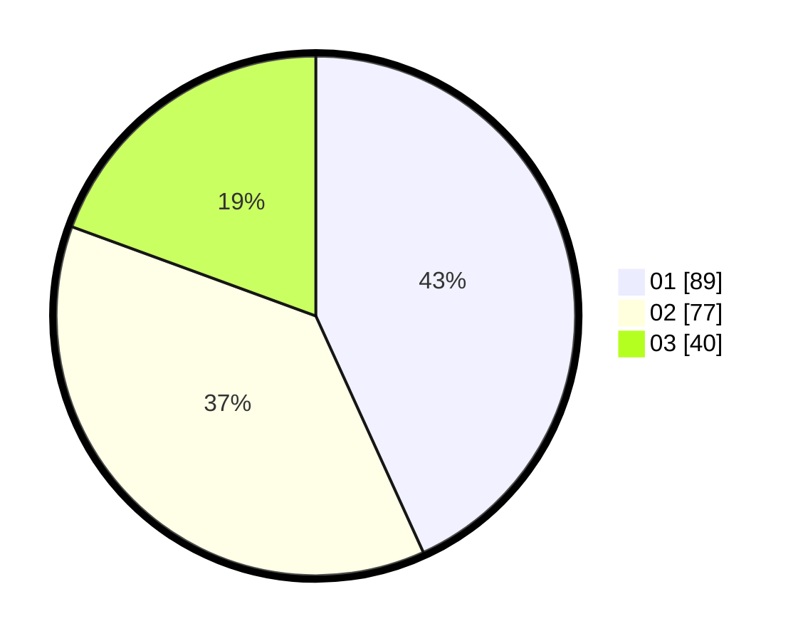

# Hasil

Hasil perolehan suara paslon dapat dilihat pada file paslon-01.txt, paslon-02.txt, dan paslon-03.txt.

Jika tidak ada, artinya data tersebut belum ada pada SIREKAP.

## Perolehan Suara

 * Paslon 01: **89**.
 * Paslon 02: **77**.
 * Paslon 03: **40**.

## Foto C Plano

https://sirekap-obj-formc.kpu.go.id/6875/pemilu/ppwp/31/71/07/10/02/3171071002039-20240216-185537--0c36272e-a954-449c-952a-373c20ab7a4a.jpg

https://sirekap-obj-formc.kpu.go.id/6875/pemilu/ppwp/31/71/07/10/02/3171071002039-20240216-145543--075a4b8b-1d7f-487a-8174-321514e044d8.jpg
