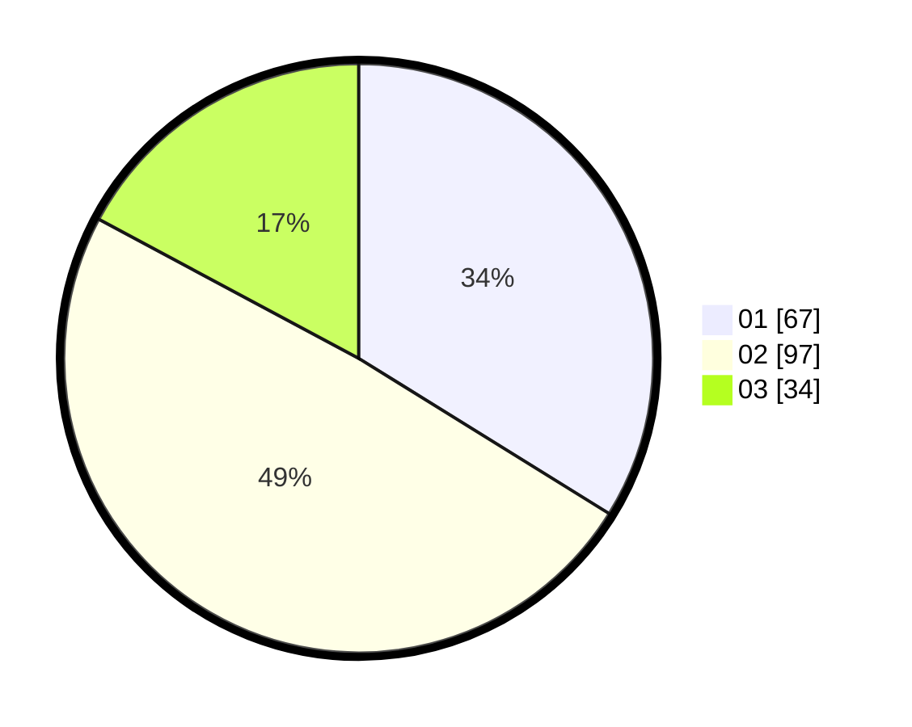

# Hasil

Hasil perolehan suara paslon dapat dilihat pada file paslon-01.txt, paslon-02.txt, dan paslon-03.txt.

Jika tidak ada, artinya data tersebut belum ada pada SIREKAP.

## Perolehan Suara

 * Paslon 01: **67**.
 * Paslon 02: **97**.
 * Paslon 03: **34**.

## Foto C Plano

https://sirekap-obj-formc.kpu.go.id/bfd4/pemilu/ppwp/31/71/07/10/02/3171071002043-20240214-155601--21e9f47a-6ffd-4f8c-bb7f-e6e6efac0647.jpg

https://sirekap-obj-formc.kpu.go.id/bfd4/pemilu/ppwp/31/71/07/10/02/3171071002043-20240214-222128--78737c2c-cae1-46fd-91c1-77433a8972a5.jpg

https://sirekap-obj-formc.kpu.go.id/bfd4/pemilu/ppwp/31/71/07/10/02/3171071002043-20240214-222134--db1ec62a-079a-41d2-b2b2-9e7c09b7887e.jpg

## DATA PEMILIH TETAP

Jumlah pemilih dalam DPT: **240**.
 * L: **115**.
 * P: **125**.

## DATA PENGGUNA HAK PILIH

Jumlah pengguna hak pilih dalam DPT: **191**.
 * L: **98**.
 * P: **93**.

Jumlah pengguna hak pilih dalam DPTb: **9**.
 * L: **4**.
 * P: **5**.

Jumlah pengguna hak pilih dalam DPK: **0**.
 * L: **0**.
 * P: **0**.

Jumlah pengguna hak pilih: **200**.
 * L: **102**.
 * P: **98**.

## JUMLAH SUARA SAH DAN TIDAK SAH

JUMLAH SELURUH SUARA SAH: **198**.

JUMLAH SUARA TIDAK SAH: **2**.

JUMLAH SELURUH SUARA SAH DAN SUARA TIDAK SAH: **200**.
