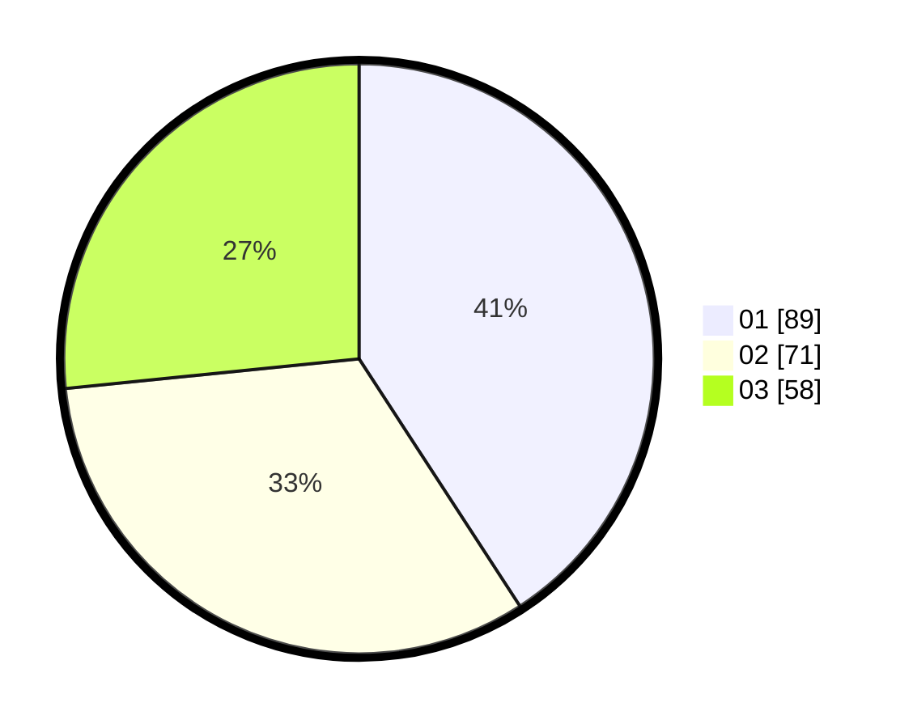

# Hasil

Hasil perolehan suara paslon dapat dilihat pada file paslon-01.txt, paslon-02.txt, dan paslon-03.txt.

Jika tidak ada, artinya data tersebut belum ada pada SIREKAP.

## Perolehan Suara

 * Paslon 01: **89**.
 * Paslon 02: **71**.
 * Paslon 03: **58**.

## Foto C Plano

https://sirekap-obj-formc.kpu.go.id/4bfd/pemilu/ppwp/31/71/07/10/02/3171071002053-20240216-171504--885a1d3f-b557-434e-9766-c70b81f4f05d.jpg

https://sirekap-obj-formc.kpu.go.id/4bfd/pemilu/ppwp/31/71/07/10/02/3171071002053-20240216-171921--adc353a7-4abb-438d-b6a7-a34588c47049.jpg

https://sirekap-obj-formc.kpu.go.id/4bfd/pemilu/ppwp/31/71/07/10/02/3171071002053-20240216-172254--f2276998-94f9-4cf5-93e6-280fe478c74f.jpg

## DATA PEMILIH TETAP

Jumlah pemilih dalam DPT: **259**.
 * L: **121**.
 * P: **138**.

## DATA PENGGUNA HAK PILIH

Jumlah pengguna hak pilih dalam DPT: **192**.
 * L: **80**.
 * P: **112**.

Jumlah pengguna hak pilih dalam DPTb: **26**.
 * L: **12**.
 * P: **14**.

Jumlah pengguna hak pilih dalam DPK: **3**.
 * L: **1**.
 * P: **2**.

Jumlah pengguna hak pilih: **221**.
 * L: **93**.
 * P: **128**.

## JUMLAH SUARA SAH DAN TIDAK SAH

JUMLAH SELURUH SUARA SAH: **221**.

JUMLAH SUARA TIDAK SAH: **3**.

JUMLAH SELURUH SUARA SAH DAN SUARA TIDAK SAH: **218**.
