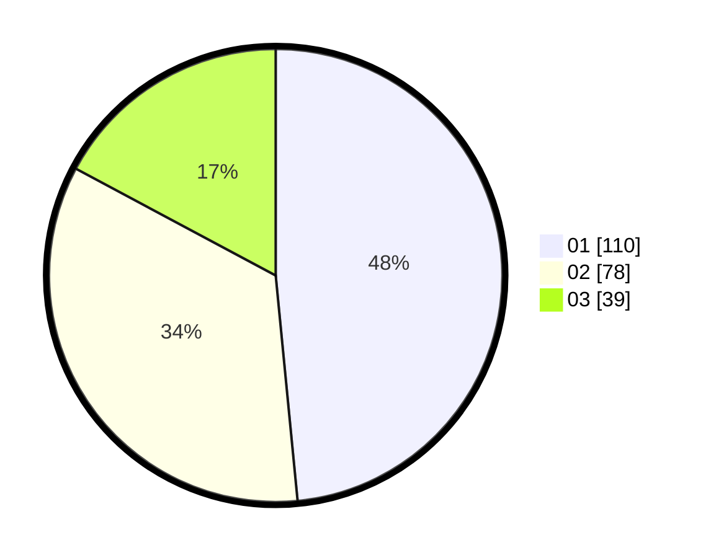

# Hasil

Hasil perolehan suara paslon dapat dilihat pada file paslon-01.txt, paslon-02.txt, dan paslon-03.txt.

Jika tidak ada, artinya data tersebut belum ada pada SIREKAP.

## Perolehan Suara

 * Paslon 01: **110**.
 * Paslon 02: **78**.
 * Paslon 03: **39**.

## Foto C Plano

https://sirekap-obj-formc.kpu.go.id/9450/pemilu/ppwp/31/71/07/10/02/3171071002054-20240217-215325--07e2076f-7aa8-47ad-960c-a55d0f26f4e6.jpg

https://sirekap-obj-formc.kpu.go.id/9450/pemilu/ppwp/31/71/07/10/02/3171071002054-20240217-215047--064e422b-75f5-494c-b52e-1fcca3206640.jpg

https://sirekap-obj-formc.kpu.go.id/9450/pemilu/ppwp/31/71/07/10/02/3171071002054-20240217-215140--f4e7fdd2-1a14-4588-882b-4f78d3d9efa9.jpg

## DATA PEMILIH TETAP

Jumlah pemilih dalam DPT: **262**.
 * L: **119**.
 * P: **143**.

## DATA PENGGUNA HAK PILIH

Jumlah pengguna hak pilih dalam DPT: **204**.
 * L: **87**.
 * P: **117**.

Jumlah pengguna hak pilih dalam DPTb: **22**.
 * L: **6**.
 * P: **16**.

Jumlah pengguna hak pilih dalam DPK: **5**.
 * L: **1**.
 * P: **4**.

Jumlah pengguna hak pilih: **231**.
 * L: **94**.
 * P: **137**.

## JUMLAH SUARA SAH DAN TIDAK SAH

JUMLAH SELURUH SUARA SAH: **227**.

JUMLAH SUARA TIDAK SAH: **4**.

JUMLAH SELURUH SUARA SAH DAN SUARA TIDAK SAH: **231**.
