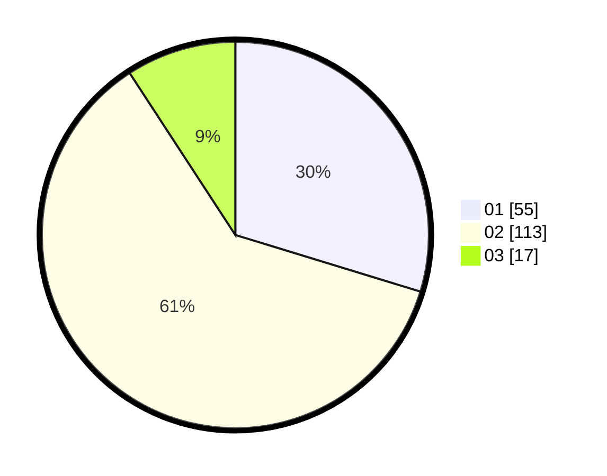

# Hasil

Hasil perolehan suara paslon dapat dilihat pada file paslon-01.txt, paslon-02.txt, dan paslon-03.txt.

Jika tidak ada, artinya data tersebut belum ada pada SIREKAP.

## Perolehan Suara

 * Paslon 01: **55**.
 * Paslon 02: **113**.
 * Paslon 03: **17**.

## Foto C Plano

https://sirekap-obj-formc.kpu.go.id/019b/pemilu/ppwp/31/71/07/10/02/3171071002057-20240214-225726--c993a275-0d37-4a9c-a838-17de2e99c7f5.jpg

https://sirekap-obj-formc.kpu.go.id/019b/pemilu/ppwp/31/71/07/10/02/3171071002057-20240214-225915--61ad10e0-e1eb-40be-85dc-0c441bf66c77.jpg

https://sirekap-obj-formc.kpu.go.id/019b/pemilu/ppwp/31/71/07/10/02/3171071002057-20240214-230117--4ec06fb0-52dd-49b6-9ad7-ba2afce6872f.jpg

## DATA PEMILIH TETAP

Jumlah pemilih dalam DPT: **278**.
 * L: **137**.
 * P: **141**.

## DATA PENGGUNA HAK PILIH

Jumlah pengguna hak pilih dalam DPT: **180**.
 * L: **77**.
 * P: **103**.

Jumlah pengguna hak pilih dalam DPTb: **4**.
 * L: **3**.
 * P: **1**.

Jumlah pengguna hak pilih dalam DPK: **2**.
 * L: **2**.
 * P: **0**.

Jumlah pengguna hak pilih: **186**.
 * L: **82**.
 * P: **104**.

## JUMLAH SUARA SAH DAN TIDAK SAH

JUMLAH SELURUH SUARA SAH: **185**.

JUMLAH SUARA TIDAK SAH: **1**.

JUMLAH SELURUH SUARA SAH DAN SUARA TIDAK SAH: **186**.
