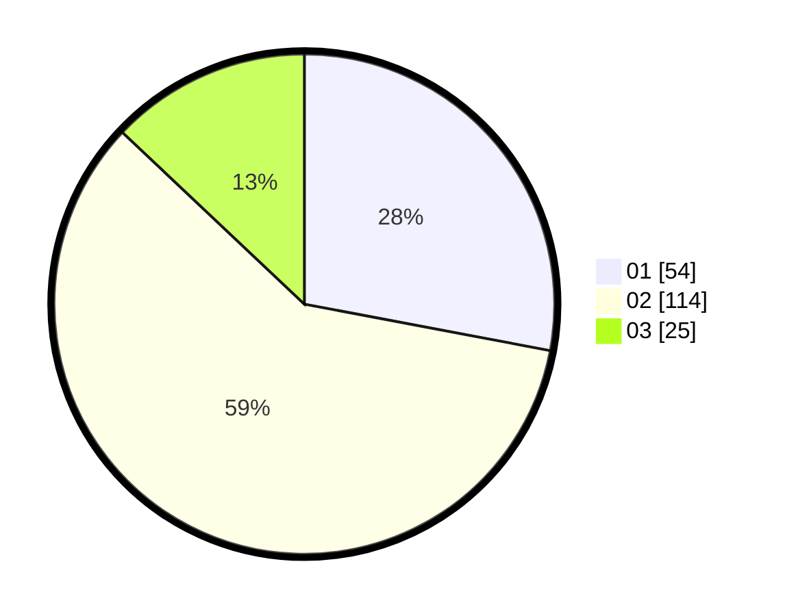

# Hasil

Hasil perolehan suara paslon dapat dilihat pada file paslon-01.txt, paslon-02.txt, dan paslon-03.txt.

Jika tidak ada, artinya data tersebut belum ada pada SIREKAP.

## Perolehan Suara

 * Paslon 01: **54**.
 * Paslon 02: **114**.
 * Paslon 03: **25**.

## Foto C Plano

https://sirekap-obj-formc.kpu.go.id/ec2f/pemilu/ppwp/31/71/07/10/02/3171071002060-20240214-155908--e5056f2e-b5c0-4f24-b9cc-efa5e8503fb6.jpg

https://sirekap-obj-formc.kpu.go.id/ec2f/pemilu/ppwp/31/71/07/10/02/3171071002060-20240214-160115--107173dd-558f-41fd-b099-5d883db8b933.jpg
