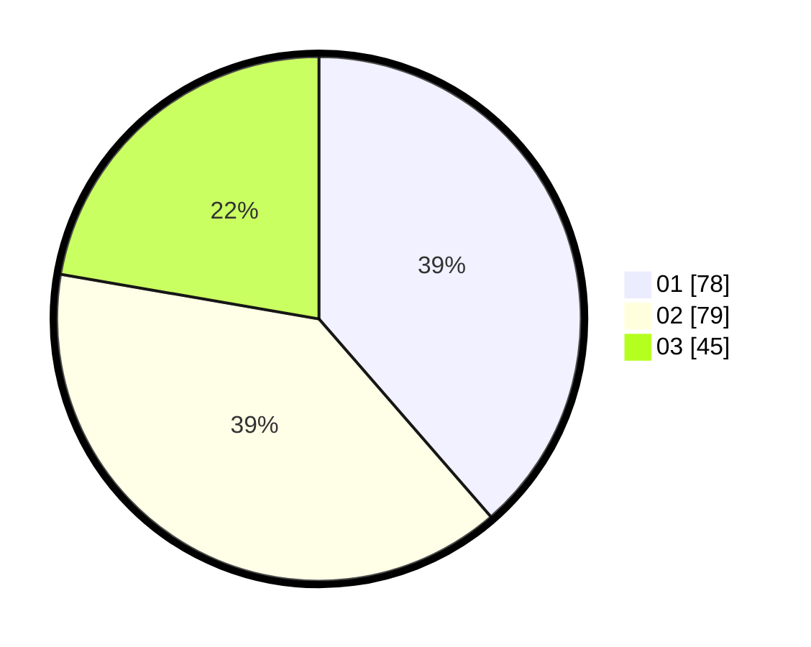

# Hasil

Hasil perolehan suara paslon dapat dilihat pada file paslon-01.txt, paslon-02.txt, dan paslon-03.txt.

Jika tidak ada, artinya data tersebut belum ada pada SIREKAP.

## Perolehan Suara

 * Paslon 01: **78**.
 * Paslon 02: **79**.
 * Paslon 03: **45**.

## Foto C Plano

https://sirekap-obj-formc.kpu.go.id/30a1/pemilu/ppwp/31/71/07/10/02/3171071002062-20240216-180553--7792fee7-1b57-426c-8f94-efb1ca71e70d.jpg

https://sirekap-obj-formc.kpu.go.id/30a1/pemilu/ppwp/31/71/07/10/02/3171071002062-20240216-175028--6b30bcdb-a19f-45a0-8878-d91e0c0cc019.jpg

https://sirekap-obj-formc.kpu.go.id/30a1/pemilu/ppwp/31/71/07/10/02/3171071002062-20240216-175321--04921b62-90ab-4112-b17f-1bc88a8fb365.jpg

## DATA PEMILIH TETAP

Jumlah pemilih dalam DPT: **274**.
 * L: **144**.
 * P: **130**.

## DATA PENGGUNA HAK PILIH

Jumlah pengguna hak pilih dalam DPT: **197**.
 * L: **96**.
 * P: **101**.

Jumlah pengguna hak pilih dalam DPTb: **7**.
 * L: **5**.
 * P: **2**.

Jumlah pengguna hak pilih dalam DPK: **0**.
 * L: **0**.
 * P: **0**.

Jumlah pengguna hak pilih: **204**.
 * L: **101**.
 * P: **103**.

## JUMLAH SUARA SAH DAN TIDAK SAH

JUMLAH SELURUH SUARA SAH: **202**.

JUMLAH SUARA TIDAK SAH: **2**.

JUMLAH SELURUH SUARA SAH DAN SUARA TIDAK SAH: **204**.
