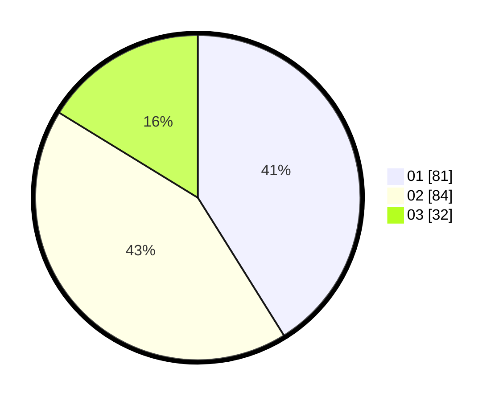

# Hasil

Hasil perolehan suara paslon dapat dilihat pada file paslon-01.txt, paslon-02.txt, dan paslon-03.txt.

Jika tidak ada, artinya data tersebut belum ada pada SIREKAP.

## Perolehan Suara

 * Paslon 01: **81**.
 * Paslon 02: **84**.
 * Paslon 03: **32**.

## Foto C Plano

https://sirekap-obj-formc.kpu.go.id/5075/pemilu/ppwp/31/71/07/10/02/3171071002063-20240214-155657--a67650ad-3f47-4dbd-aa97-af24c9e220d9.jpg

https://sirekap-obj-formc.kpu.go.id/5075/pemilu/ppwp/31/71/07/10/02/3171071002063-20240214-190223--7603f162-f7a8-4949-a22e-cc5a8f6f50dc.jpg

https://sirekap-obj-formc.kpu.go.id/5075/pemilu/ppwp/31/71/07/10/02/3171071002063-20240214-155728--78fe3da0-1195-432a-98f9-88772e61f2ac.jpg
