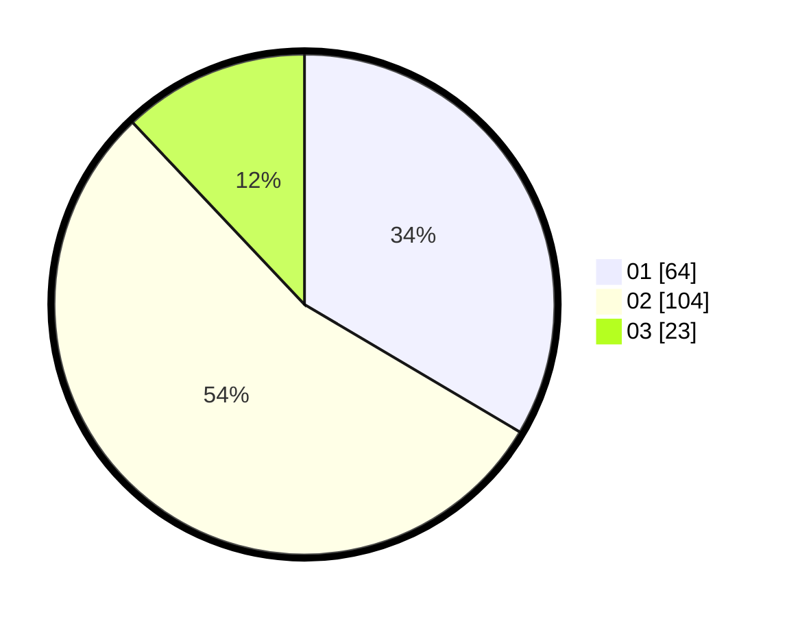

# Hasil

Hasil perolehan suara paslon dapat dilihat pada file paslon-01.txt, paslon-02.txt, dan paslon-03.txt.

Jika tidak ada, artinya data tersebut belum ada pada SIREKAP.

## Perolehan Suara

 * Paslon 01: **64**.
 * Paslon 02: **104**.
 * Paslon 03: **23**.

## Foto C Plano

https://sirekap-obj-formc.kpu.go.id/7c64/pemilu/ppwp/31/71/07/10/02/3171071002064-20240214-155116--f0b4bbf7-794c-450f-a5a0-0d130bc9f063.jpg

https://sirekap-obj-formc.kpu.go.id/7c64/pemilu/ppwp/31/71/07/10/02/3171071002064-20240214-200126--aa492859-334e-421a-b7f1-5459848ea441.jpg

https://sirekap-obj-formc.kpu.go.id/7c64/pemilu/ppwp/31/71/07/10/02/3171071002064-20240214-155152--96d31b3a-155a-4cc8-9d9f-33fa608c3bb7.jpg

## DATA PEMILIH TETAP

Jumlah pemilih dalam DPT: **267**.
 * L: **136**.
 * P: **131**.

## DATA PENGGUNA HAK PILIH

Jumlah pengguna hak pilih dalam DPT: **177**.
 * L: **83**.
 * P: **94**.

Jumlah pengguna hak pilih dalam DPTb: **14**.
 * L: **2**.
 * P: **12**.

Jumlah pengguna hak pilih dalam DPK: **2**.
 * L: **1**.
 * P: **1**.

Jumlah pengguna hak pilih: **193**.
 * L: **86**.
 * P: **107**.

## JUMLAH SUARA SAH DAN TIDAK SAH

JUMLAH SELURUH SUARA SAH: **191**.

JUMLAH SUARA TIDAK SAH: **2**.

JUMLAH SELURUH SUARA SAH DAN SUARA TIDAK SAH: **193**.
