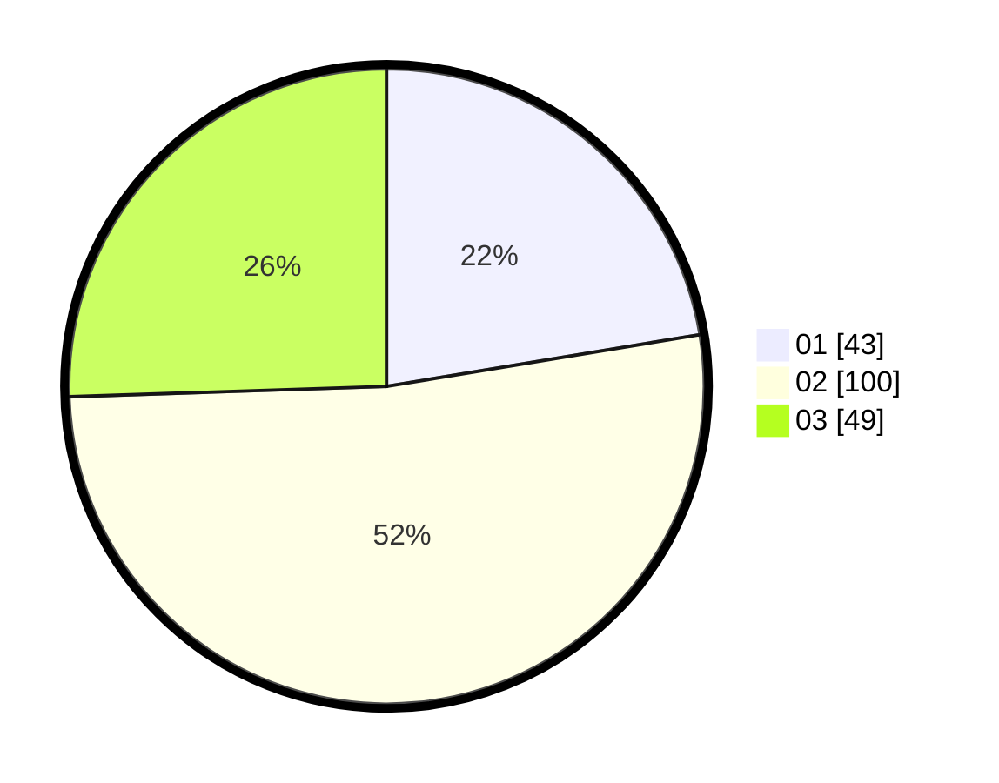

# Hasil

Hasil perolehan suara paslon dapat dilihat pada file paslon-01.txt, paslon-02.txt, dan paslon-03.txt.

Jika tidak ada, artinya data tersebut belum ada pada SIREKAP.

## Perolehan Suara

 * Paslon 01: **43**.
 * Paslon 02: **100**.
 * Paslon 03: **49**.

## Foto C Plano

https://sirekap-obj-formc.kpu.go.id/a9ce/pemilu/ppwp/31/71/07/10/02/3171071002070-20240216-173743--5e9a1743-389a-44e3-8911-d7bd47fe8657.jpg

https://sirekap-obj-formc.kpu.go.id/a9ce/pemilu/ppwp/31/71/07/10/02/3171071002070-20240216-174006--b90a3a73-7469-4368-aa46-416343ee4e2c.jpg

https://sirekap-obj-formc.kpu.go.id/a9ce/pemilu/ppwp/31/71/07/10/02/3171071002070-20240216-174318--8ba61c21-3d92-41cf-adaf-f243b7e531a2.jpg

## DATA PEMILIH TETAP

Jumlah pemilih dalam DPT: **272**.
 * L: **141**.
 * P: **131**.

## DATA PENGGUNA HAK PILIH

Jumlah pengguna hak pilih dalam DPT: **178**.
 * L: **87**.
 * P: **91**.

Jumlah pengguna hak pilih dalam DPTb: **15**.
 * L: **4**.
 * P: **11**.

Jumlah pengguna hak pilih dalam DPK: **0**.
 * L: **0**.
 * P: **0**.

Jumlah pengguna hak pilih: **193**.
 * L: **91**.
 * P: **102**.

## JUMLAH SUARA SAH DAN TIDAK SAH

JUMLAH SELURUH SUARA SAH: **192**.

JUMLAH SUARA TIDAK SAH: **1**.

JUMLAH SELURUH SUARA SAH DAN SUARA TIDAK SAH: **193**.
