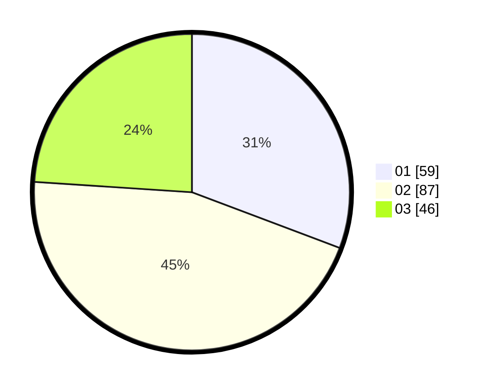

# Hasil

Hasil perolehan suara paslon dapat dilihat pada file paslon-01.txt, paslon-02.txt, dan paslon-03.txt.

Jika tidak ada, artinya data tersebut belum ada pada SIREKAP.

## Perolehan Suara

 * Paslon 01: **59**.
 * Paslon 02: **87**.
 * Paslon 03: **46**.

## Foto C Plano

https://sirekap-obj-formc.kpu.go.id/b07c/pemilu/ppwp/31/71/07/10/02/3171071002072-20240216-173546--416b52db-5a61-4424-ad27-6deb543ee357.jpg

https://sirekap-obj-formc.kpu.go.id/b07c/pemilu/ppwp/31/71/07/10/02/3171071002072-20240216-165723--cedd0492-a6b1-4d75-96a8-505c9943a975.jpg

https://sirekap-obj-formc.kpu.go.id/b07c/pemilu/ppwp/31/71/07/10/02/3171071002072-20240216-173857--255547a9-7e50-4846-9cbb-23ff9cb08c99.jpg

## DATA PEMILIH TETAP

Jumlah pemilih dalam DPT: **244**.
 * L: **114**.
 * P: **130**.

## DATA PENGGUNA HAK PILIH

Jumlah pengguna hak pilih dalam DPT: **174**.
 * L: **79**.
 * P: **95**.

Jumlah pengguna hak pilih dalam DPTb: **19**.
 * L: **10**.
 * P: **9**.

Jumlah pengguna hak pilih dalam DPK: **1**.
 * L: **1**.
 * P: **0**.

Jumlah pengguna hak pilih: **194**.
 * L: **90**.
 * P: **104**.

## JUMLAH SUARA SAH DAN TIDAK SAH

JUMLAH SELURUH SUARA SAH: **192**.

JUMLAH SUARA TIDAK SAH: **2**.

JUMLAH SELURUH SUARA SAH DAN SUARA TIDAK SAH: **194**.
