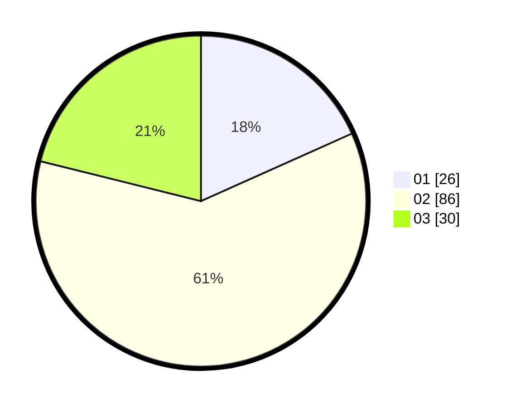

# Hasil

Hasil perolehan suara paslon dapat dilihat pada file paslon-01.txt, paslon-02.txt, dan paslon-03.txt.

Jika tidak ada, artinya data tersebut belum ada pada SIREKAP.

## Perolehan Suara

 * Paslon 01: **26**.
 * Paslon 02: **86**.
 * Paslon 03: **30**.

## Foto C Plano

https://sirekap-obj-formc.kpu.go.id/a7bf/pemilu/ppwp/31/71/07/10/02/3171071002073-20240216-185151--c2a29ea5-94e5-49b2-8ac6-aa4b1bd7c214.jpg

https://sirekap-obj-formc.kpu.go.id/a7bf/pemilu/ppwp/31/71/07/10/02/3171071002073-20240216-185233--264c8128-b5ed-4fd6-a1d4-9d281be387c1.jpg
