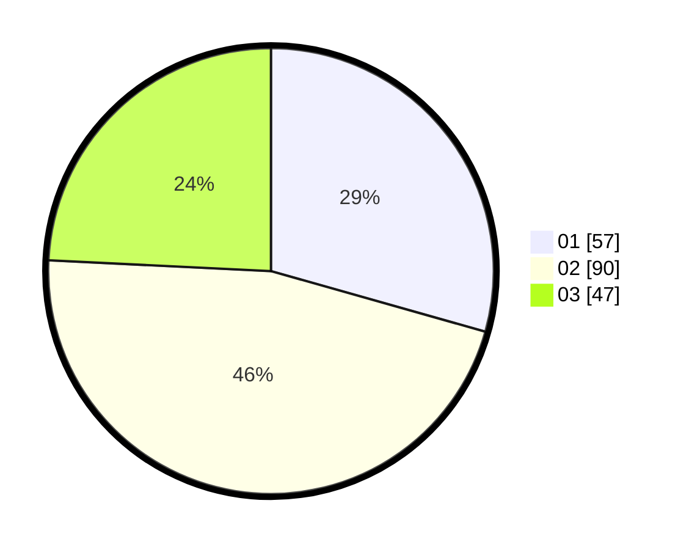

# Hasil

Hasil perolehan suara paslon dapat dilihat pada file paslon-01.txt, paslon-02.txt, dan paslon-03.txt.

Jika tidak ada, artinya data tersebut belum ada pada SIREKAP.

## Perolehan Suara

 * Paslon 01: **57**.
 * Paslon 02: **90**.
 * Paslon 03: **47**.

## Foto C Plano

https://sirekap-obj-formc.kpu.go.id/3548/pemilu/ppwp/31/71/07/10/02/3171071002074-20240214-224505--cfbda1f7-39cc-4b3d-aed7-775b083504ce.jpg

https://sirekap-obj-formc.kpu.go.id/3548/pemilu/ppwp/31/71/07/10/02/3171071002074-20240214-224631--f0b3de0a-4c4a-4875-8200-c889eb173df2.jpg

https://sirekap-obj-formc.kpu.go.id/3548/pemilu/ppwp/31/71/07/10/02/3171071002074-20240214-224809--fa50574d-0043-4adc-86e4-7eb930c0003b.jpg

## DATA PEMILIH TETAP

Jumlah pemilih dalam DPT: **276**.
 * L: **131**.
 * P: **145**.

## DATA PENGGUNA HAK PILIH

Jumlah pengguna hak pilih dalam DPT: **173**.
 * L: **75**.
 * P: **98**.

Jumlah pengguna hak pilih dalam DPTb: **19**.
 * L: **6**.
 * P: **13**.

Jumlah pengguna hak pilih dalam DPK: **2**.
 * L: **0**.
 * P: **2**.

Jumlah pengguna hak pilih: **194**.
 * L: **81**.
 * P: **113**.

## JUMLAH SUARA SAH DAN TIDAK SAH

JUMLAH SELURUH SUARA SAH: **194**.

JUMLAH SUARA TIDAK SAH: **0**.

JUMLAH SELURUH SUARA SAH DAN SUARA TIDAK SAH: **194**.
