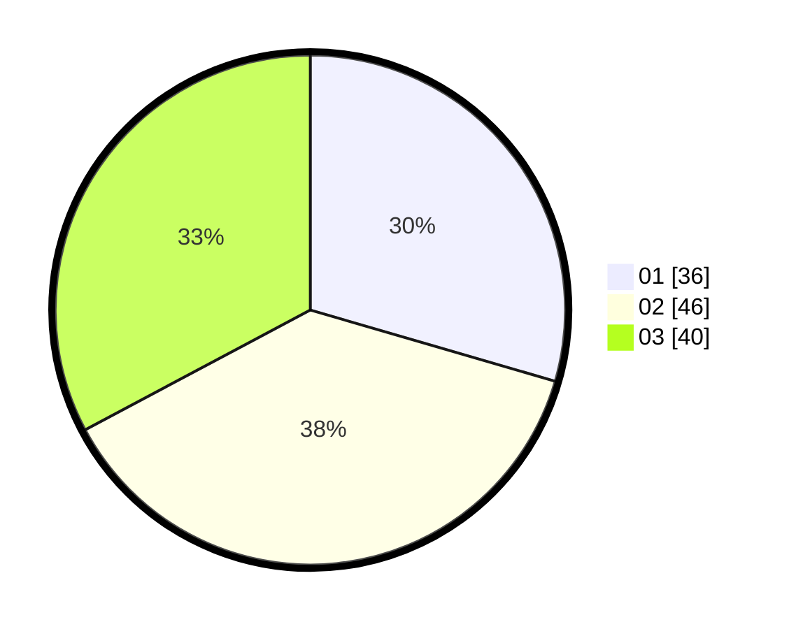

# Hasil

Hasil perolehan suara paslon dapat dilihat pada file paslon-01.txt, paslon-02.txt, dan paslon-03.txt.

Jika tidak ada, artinya data tersebut belum ada pada SIREKAP.

## Perolehan Suara

 * Paslon 01: **36**.
 * Paslon 02: **46**.
 * Paslon 03: **40**.

## Foto C Plano

https://sirekap-obj-formc.kpu.go.id/c869/pemilu/ppwp/31/71/07/10/02/3171071002076-20240214-210539--bda2e4e9-f77b-4a00-a2e7-4e67c8d3b7a6.jpg

https://sirekap-obj-formc.kpu.go.id/c869/pemilu/ppwp/31/71/07/10/02/3171071002076-20240214-210549--77ee3410-a84b-42a6-b371-f5c350ab69e3.jpg
