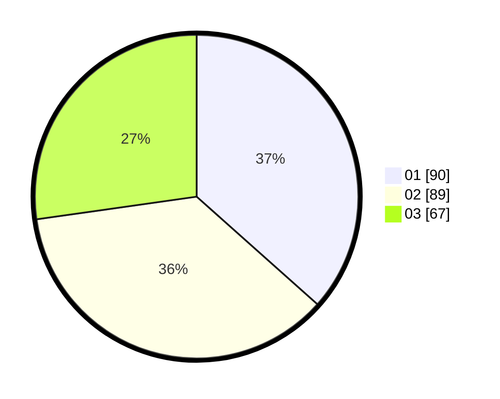

# Hasil

Hasil perolehan suara paslon dapat dilihat pada file paslon-01.txt, paslon-02.txt, dan paslon-03.txt.

Jika tidak ada, artinya data tersebut belum ada pada SIREKAP.

## Perolehan Suara

 * Paslon 01: **90**.
 * Paslon 02: **89**.
 * Paslon 03: **67**.

## Foto C Plano

https://sirekap-obj-formc.kpu.go.id/1443/pemilu/ppwp/31/71/07/10/03/3171071003001-20240216-214026--9b6c8057-26fe-4768-b2d8-17376281e228.jpg

https://sirekap-obj-formc.kpu.go.id/1443/pemilu/ppwp/31/71/07/10/03/3171071003001-20240216-220313--1353735d-c409-49e3-8e9a-a31722dabef9.jpg

https://sirekap-obj-formc.kpu.go.id/1443/pemilu/ppwp/31/71/07/10/03/3171071003001-20240216-214654--dead87f8-cd53-472f-8ba6-f13e66d26174.jpg

## DATA PEMILIH TETAP

Jumlah pemilih dalam DPT: **291**.
 * L: **136**.
 * P: **155**.

## DATA PENGGUNA HAK PILIH

Jumlah pengguna hak pilih dalam DPT: **234**.
 * L: **107**.
 * P: **127**.

Jumlah pengguna hak pilih dalam DPTb: **15**.
 * L: **5**.
 * P: **10**.

Jumlah pengguna hak pilih dalam DPK: **5**.
 * L: **2**.
 * P: **3**.

Jumlah pengguna hak pilih: **254**.
 * L: **114**.
 * P: **140**.

## JUMLAH SUARA SAH DAN TIDAK SAH

JUMLAH SELURUH SUARA SAH: **246**.

JUMLAH SUARA TIDAK SAH: **8**.

JUMLAH SELURUH SUARA SAH DAN SUARA TIDAK SAH: **254**.
