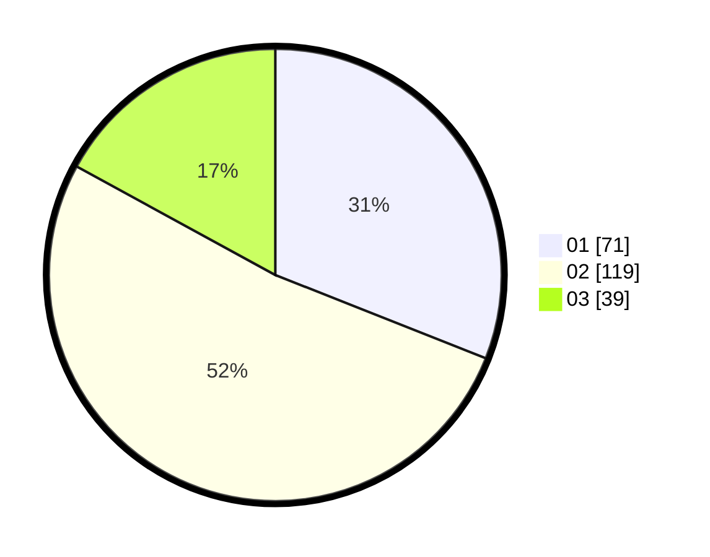

# Hasil

Hasil perolehan suara paslon dapat dilihat pada file paslon-01.txt, paslon-02.txt, dan paslon-03.txt.

Jika tidak ada, artinya data tersebut belum ada pada SIREKAP.

## Perolehan Suara

 * Paslon 01: **71**.
 * Paslon 02: **119**.
 * Paslon 03: **39**.

## Foto C Plano

https://sirekap-obj-formc.kpu.go.id/42c8/pemilu/ppwp/31/71/07/10/03/3171071003002-20240214-193336--492e573d-4c9b-4705-956f-a3cc2435a602.jpg

https://sirekap-obj-formc.kpu.go.id/42c8/pemilu/ppwp/31/71/07/10/03/3171071003002-20240214-203940--ecf13786-2f4b-48c1-b508-f36d9e3c69e4.jpg

https://sirekap-obj-formc.kpu.go.id/42c8/pemilu/ppwp/31/71/07/10/03/3171071003002-20240214-204247--52205551-3a82-4dea-8a84-dbdf9ee67a19.jpg

## DATA PEMILIH TETAP

Jumlah pemilih dalam DPT: **294**.
 * L: **150**.
 * P: **144**.

## DATA PENGGUNA HAK PILIH

Jumlah pengguna hak pilih dalam DPT: **217**.
 * L: **103**.
 * P: **114**.

Jumlah pengguna hak pilih dalam DPTb: **16**.
 * L: **5**.
 * P: **11**.

Jumlah pengguna hak pilih dalam DPK: **5**.
 * L: **3**.
 * P: **2**.

Jumlah pengguna hak pilih: **238**.
 * L: **111**.
 * P: **127**.

## JUMLAH SUARA SAH DAN TIDAK SAH

JUMLAH SELURUH SUARA SAH: **229**.

JUMLAH SUARA TIDAK SAH: **11**.

JUMLAH SELURUH SUARA SAH DAN SUARA TIDAK SAH: **240**.
