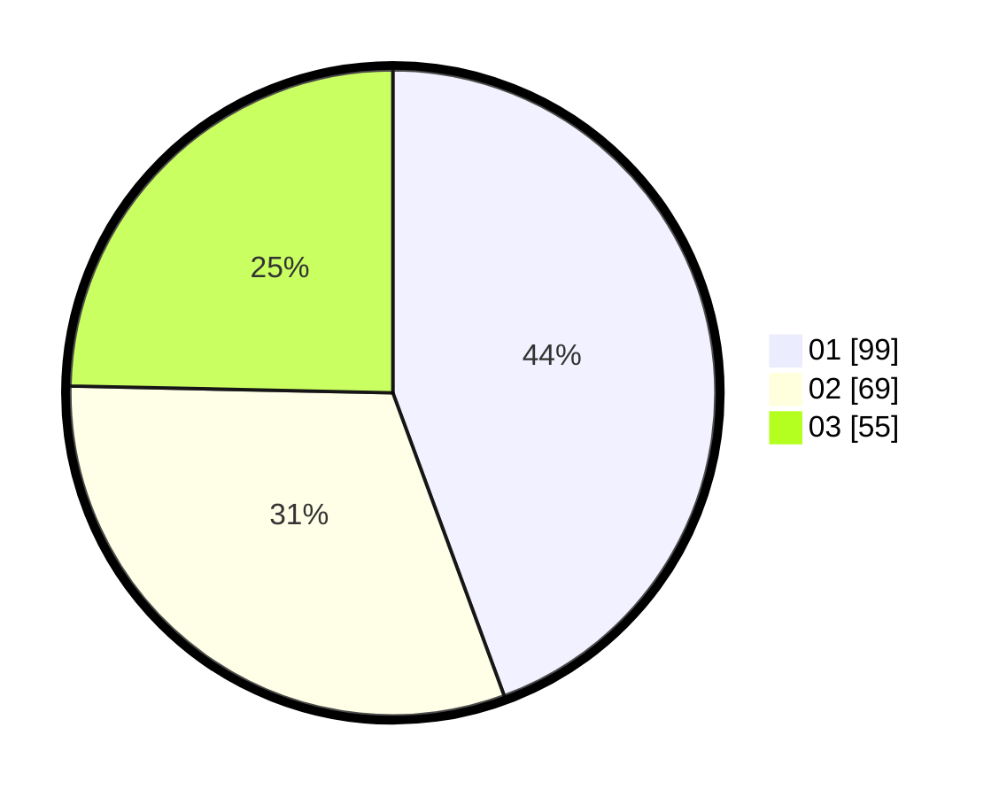

# Hasil

Hasil perolehan suara paslon dapat dilihat pada file paslon-01.txt, paslon-02.txt, dan paslon-03.txt.

Jika tidak ada, artinya data tersebut belum ada pada SIREKAP.

## Perolehan Suara

 * Paslon 01: **99**.
 * Paslon 02: **69**.
 * Paslon 03: **55**.

## Foto C Plano

https://sirekap-obj-formc.kpu.go.id/24f1/pemilu/ppwp/31/71/07/10/03/3171071003003-20240217-113104--e1e594ed-11d2-4fd3-b948-e988d06b9ee0.jpg

https://sirekap-obj-formc.kpu.go.id/24f1/pemilu/ppwp/31/71/07/10/03/3171071003003-20240217-113106--fb0b43fd-89a4-4045-bd8c-8b274845f417.jpg

https://sirekap-obj-formc.kpu.go.id/24f1/pemilu/ppwp/31/71/07/10/03/3171071003003-20240217-113105--5da90c8e-a5a0-4a7b-aed3-170cc1cf2da1.jpg

## DATA PEMILIH TETAP

Jumlah pemilih dalam DPT: **270**.
 * L: **139**.
 * P: **131**.

## DATA PENGGUNA HAK PILIH

Jumlah pengguna hak pilih dalam DPT: **203**.
 * L: **100**.
 * P: **103**.

Jumlah pengguna hak pilih dalam DPTb: **24**.
 * L: **5**.
 * P: **19**.

Jumlah pengguna hak pilih dalam DPK: **2**.
 * L: **1**.
 * P: **1**.

Jumlah pengguna hak pilih: **229**.
 * L: **106**.
 * P: **123**.

## JUMLAH SUARA SAH DAN TIDAK SAH

JUMLAH SELURUH SUARA SAH: **223**.

JUMLAH SUARA TIDAK SAH: **6**.

JUMLAH SELURUH SUARA SAH DAN SUARA TIDAK SAH: **229**.
