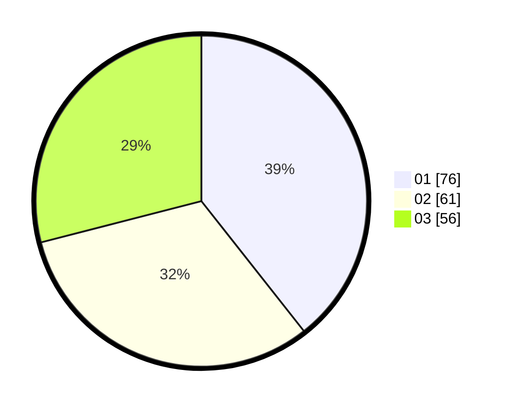

# Hasil

Hasil perolehan suara paslon dapat dilihat pada file paslon-01.txt, paslon-02.txt, dan paslon-03.txt.

Jika tidak ada, artinya data tersebut belum ada pada SIREKAP.

## Perolehan Suara

 * Paslon 01: **76**.
 * Paslon 02: **61**.
 * Paslon 03: **56**.

## Foto C Plano

https://sirekap-obj-formc.kpu.go.id/dd61/pemilu/ppwp/31/71/07/10/03/3171071003004-20240217-103628--aefaaa21-f5b5-457b-85f5-96fb40aabaf4.jpg

https://sirekap-obj-formc.kpu.go.id/dd61/pemilu/ppwp/31/71/07/10/03/3171071003004-20240217-103629--1c8c7be4-1459-4152-bfc2-0a60ce30c38e.jpg

https://sirekap-obj-formc.kpu.go.id/dd61/pemilu/ppwp/31/71/07/10/03/3171071003004-20240217-103629--23d9bdd8-d5ac-403a-98b3-7c3f2ea312f2.jpg

## DATA PEMILIH TETAP

Jumlah pemilih dalam DPT: **270**.
 * L: **121**.
 * P: **149**.

## DATA PENGGUNA HAK PILIH

Jumlah pengguna hak pilih dalam DPT: **181**.
 * L: **77**.
 * P: **104**.

Jumlah pengguna hak pilih dalam DPTb: **13**.
 * L: **5**.
 * P: **8**.

Jumlah pengguna hak pilih dalam DPK: **1**.
 * L: **1**.
 * P: **0**.

Jumlah pengguna hak pilih: **195**.
 * L: **83**.
 * P: **112**.

## JUMLAH SUARA SAH DAN TIDAK SAH

JUMLAH SELURUH SUARA SAH: **193**.

JUMLAH SUARA TIDAK SAH: **2**.

JUMLAH SELURUH SUARA SAH DAN SUARA TIDAK SAH: **195**.
