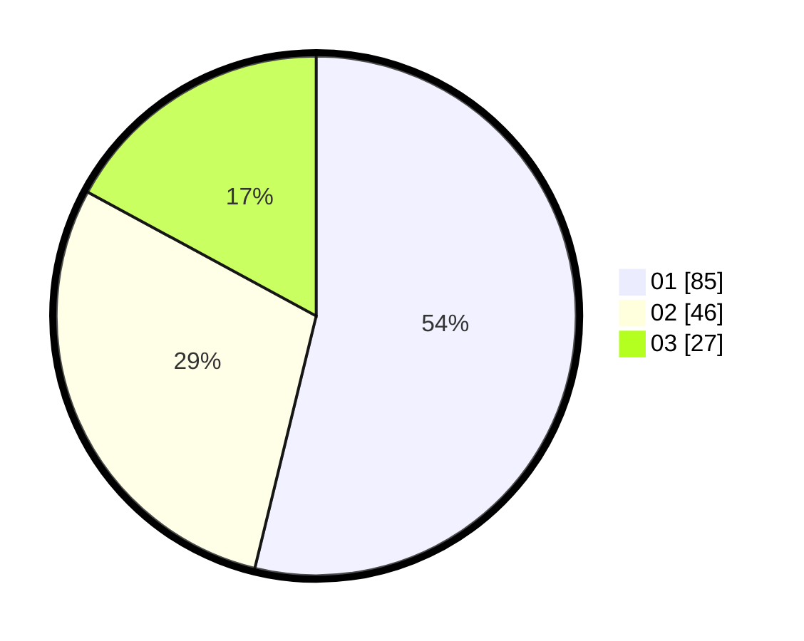

# Hasil

Hasil perolehan suara paslon dapat dilihat pada file paslon-01.txt, paslon-02.txt, dan paslon-03.txt.

Jika tidak ada, artinya data tersebut belum ada pada SIREKAP.

## Perolehan Suara

 * Paslon 01: **85**.
 * Paslon 02: **46**.
 * Paslon 03: **27**.

## Foto C Plano

https://sirekap-obj-formc.kpu.go.id/59e9/pemilu/ppwp/31/71/07/10/03/3171071003005-20240214-234213--937f73bf-2d9e-4958-b89a-448880858810.jpg

https://sirekap-obj-formc.kpu.go.id/59e9/pemilu/ppwp/31/71/07/10/03/3171071003005-20240214-234304--d7ce6c3c-cc0c-4cd7-ab5c-132bcbaeb0e2.jpg

https://sirekap-obj-formc.kpu.go.id/59e9/pemilu/ppwp/31/71/07/10/03/3171071003005-20240214-234423--bf8fd68c-ecc0-48a8-b347-f2423975d3a3.jpg

## DATA PEMILIH TETAP

Jumlah pemilih dalam DPT: **205**.
 * L: **101**.
 * P: **104**.

## DATA PENGGUNA HAK PILIH

Jumlah pengguna hak pilih dalam DPT: **152**.
 * L: **73**.
 * P: **79**.

Jumlah pengguna hak pilih dalam DPTb: **7**.
 * L: **3**.
 * P: **4**.

Jumlah pengguna hak pilih dalam DPK: **0**.
 * L: **0**.
 * P: **0**.

Jumlah pengguna hak pilih: **159**.
 * L: **76**.
 * P: **83**.

## JUMLAH SUARA SAH DAN TIDAK SAH

JUMLAH SELURUH SUARA SAH: **158**.

JUMLAH SUARA TIDAK SAH: **1**.

JUMLAH SELURUH SUARA SAH DAN SUARA TIDAK SAH: **159**.
