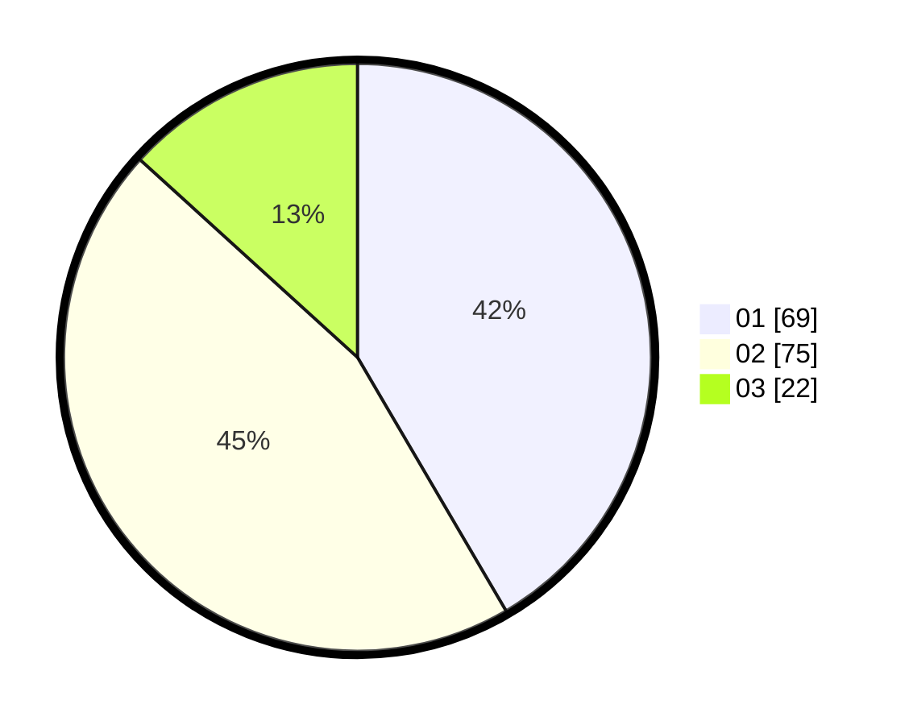

# Hasil

Hasil perolehan suara paslon dapat dilihat pada file paslon-01.txt, paslon-02.txt, dan paslon-03.txt.

Jika tidak ada, artinya data tersebut belum ada pada SIREKAP.

## Perolehan Suara

 * Paslon 01: **69**.
 * Paslon 02: **75**.
 * Paslon 03: **22**.

## Foto C Plano

https://sirekap-obj-formc.kpu.go.id/91bc/pemilu/ppwp/31/71/07/10/03/3171071003007-20240214-235627--c67daabe-edee-47b9-abb1-7a49b10daaed.jpg

https://sirekap-obj-formc.kpu.go.id/91bc/pemilu/ppwp/31/71/07/10/03/3171071003007-20240214-185428--dad3def9-bed3-4968-b3e2-fef38a7b917c.jpg

https://sirekap-obj-formc.kpu.go.id/91bc/pemilu/ppwp/31/71/07/10/03/3171071003007-20240214-185554--13d3429b-3bf6-4f63-8400-ecb2543b68ff.jpg

## DATA PEMILIH TETAP

Jumlah pemilih dalam DPT: **211**.
 * L: **121**.
 * P: **90**.

## DATA PENGGUNA HAK PILIH

Jumlah pengguna hak pilih dalam DPT: **160**.
 * L: **88**.
 * P: **72**.

Jumlah pengguna hak pilih dalam DPTb: **2**.
 * L: **1**.
 * P: **1**.

Jumlah pengguna hak pilih dalam DPK: **4**.
 * L: **1**.
 * P: **3**.

Jumlah pengguna hak pilih: **166**.
 * L: **90**.
 * P: **76**.

## JUMLAH SUARA SAH DAN TIDAK SAH

JUMLAH SELURUH SUARA SAH: **166**.

JUMLAH SUARA TIDAK SAH: **4**.

JUMLAH SELURUH SUARA SAH DAN SUARA TIDAK SAH: **170**.
