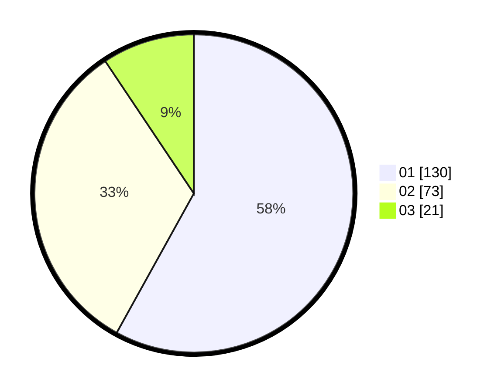

# Hasil

Hasil perolehan suara paslon dapat dilihat pada file paslon-01.txt, paslon-02.txt, dan paslon-03.txt.

Jika tidak ada, artinya data tersebut belum ada pada SIREKAP.

## Perolehan Suara

 * Paslon 01: **130**.
 * Paslon 02: **73**.
 * Paslon 03: **21**.

## Foto C Plano

https://sirekap-obj-formc.kpu.go.id/3579/pemilu/ppwp/31/71/07/10/03/3171071003009-20240214-214340--78ae03a8-5059-41e8-923c-cb3540c3b3e7.jpg

https://sirekap-obj-formc.kpu.go.id/3579/pemilu/ppwp/31/71/07/10/03/3171071003009-20240214-214417--f6e108bb-e970-4a99-af20-96b0e6a51aa1.jpg

https://sirekap-obj-formc.kpu.go.id/3579/pemilu/ppwp/31/71/07/10/03/3171071003009-20240214-214457--f1f9d6e5-0f26-4c8d-9bc3-d008d85a5622.jpg

## DATA PEMILIH TETAP

Jumlah pemilih dalam DPT: **284**.
 * L: **136**.
 * P: **148**.

## DATA PENGGUNA HAK PILIH

Jumlah pengguna hak pilih dalam DPT: **216**.
 * L: **99**.
 * P: **117**.

Jumlah pengguna hak pilih dalam DPTb: **11**.
 * L: **3**.
 * P: **8**.

Jumlah pengguna hak pilih dalam DPK: **0**.
 * L: **0**.
 * P: **0**.

Jumlah pengguna hak pilih: **227**.
 * L: **102**.
 * P: **125**.

## JUMLAH SUARA SAH DAN TIDAK SAH

JUMLAH SELURUH SUARA SAH: **224**.

JUMLAH SUARA TIDAK SAH: **3**.

JUMLAH SELURUH SUARA SAH DAN SUARA TIDAK SAH: **227**.
