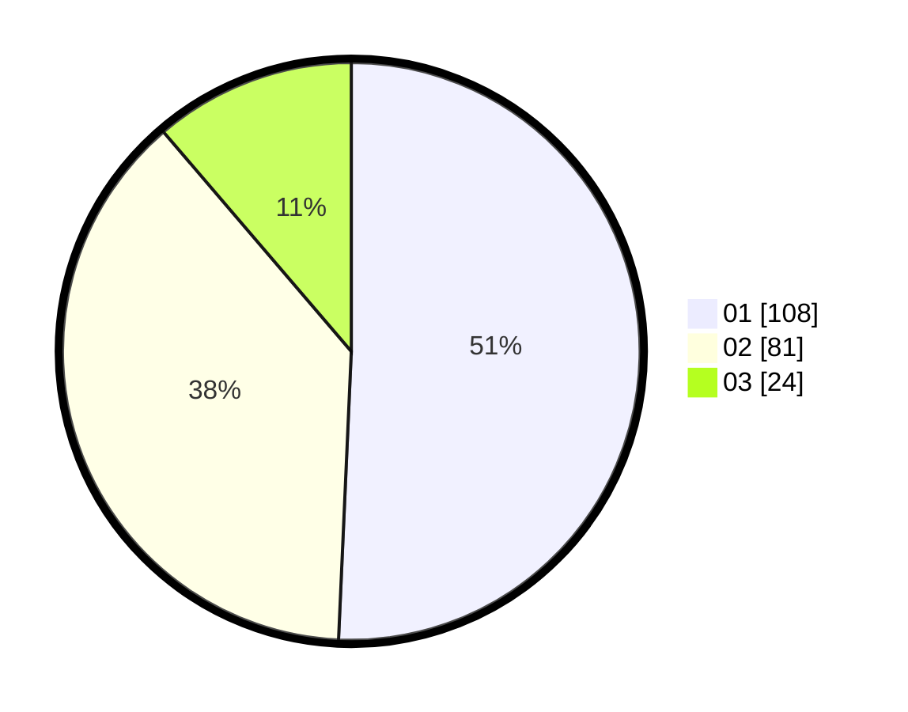

# Hasil

Hasil perolehan suara paslon dapat dilihat pada file paslon-01.txt, paslon-02.txt, dan paslon-03.txt.

Jika tidak ada, artinya data tersebut belum ada pada SIREKAP.

## Perolehan Suara

 * Paslon 01: **108**.
 * Paslon 02: **81**.
 * Paslon 03: **24**.

## Foto C Plano

https://sirekap-obj-formc.kpu.go.id/712b/pemilu/ppwp/31/71/07/10/03/3171071003011-20240214-200558--9c475e16-d995-4da6-a30e-8bd25b0a8182.jpg

https://sirekap-obj-formc.kpu.go.id/712b/pemilu/ppwp/31/71/07/10/03/3171071003011-20240214-222421--a3b6a19d-0d20-4619-93a4-84189f11bd28.jpg

https://sirekap-obj-formc.kpu.go.id/712b/pemilu/ppwp/31/71/07/10/03/3171071003011-20240214-200644--b041334b-dee7-4da7-be54-9618339a98bd.jpg

## DATA PEMILIH TETAP

Jumlah pemilih dalam DPT: **278**.
 * L: **140**.
 * P: **138**.

## DATA PENGGUNA HAK PILIH

Jumlah pengguna hak pilih dalam DPT: **211**.
 * L: **102**.
 * P: **109**.

Jumlah pengguna hak pilih dalam DPTb: **1**.
 * L: **0**.
 * P: **1**.

Jumlah pengguna hak pilih dalam DPK: **2**.
 * L: **0**.
 * P: **2**.

Jumlah pengguna hak pilih: **214**.
 * L: **102**.
 * P: **112**.

## JUMLAH SUARA SAH DAN TIDAK SAH

JUMLAH SELURUH SUARA SAH: **213**.

JUMLAH SUARA TIDAK SAH: **1**.

JUMLAH SELURUH SUARA SAH DAN SUARA TIDAK SAH: **214**.
