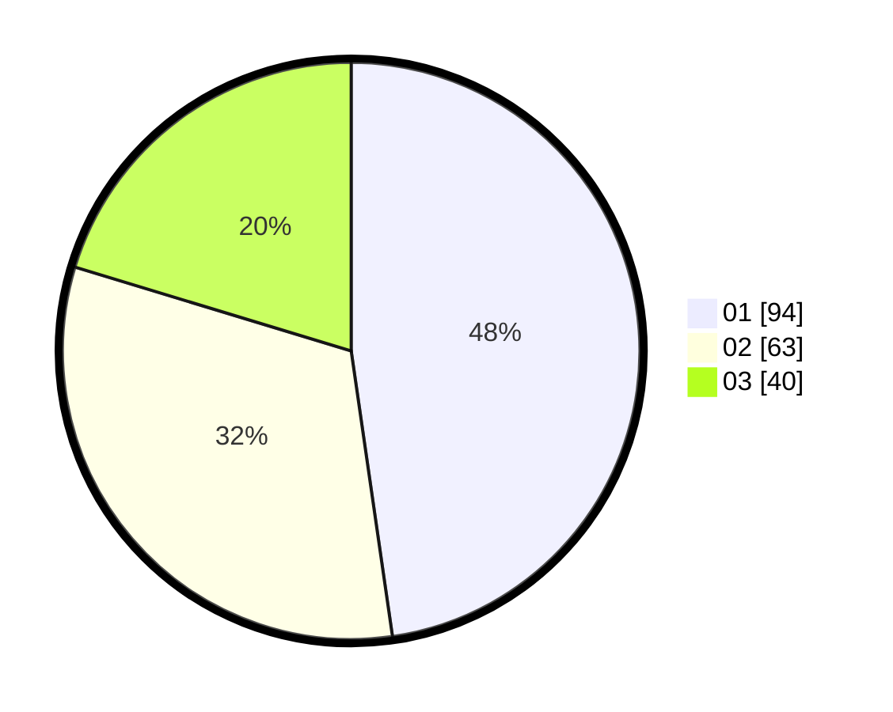

# Hasil

Hasil perolehan suara paslon dapat dilihat pada file paslon-01.txt, paslon-02.txt, dan paslon-03.txt.

Jika tidak ada, artinya data tersebut belum ada pada SIREKAP.

## Perolehan Suara

 * Paslon 01: **94**.
 * Paslon 02: **63**.
 * Paslon 03: **40**.

## Foto C Plano

https://sirekap-obj-formc.kpu.go.id/cef7/pemilu/ppwp/31/71/07/10/03/3171071003016-20240215-012638--1dc8dff2-d493-475e-b7d1-edf634d27481.jpg

https://sirekap-obj-formc.kpu.go.id/cef7/pemilu/ppwp/31/71/07/10/03/3171071003016-20240215-012918--12f171f8-4933-4027-a067-2362e637eabf.jpg

https://sirekap-obj-formc.kpu.go.id/cef7/pemilu/ppwp/31/71/07/10/03/3171071003016-20240215-013157--5d7977a5-613e-4da0-8657-18e14a8879c0.jpg

## DATA PEMILIH TETAP

Jumlah pemilih dalam DPT: **226**.
 * L: **110**.
 * P: **116**.

## DATA PENGGUNA HAK PILIH

Jumlah pengguna hak pilih dalam DPT: **199**.
 * L: **98**.
 * P: **101**.

Jumlah pengguna hak pilih dalam DPTb: **0**.
 * L: **0**.
 * P: **0**.

Jumlah pengguna hak pilih dalam DPK: **2**.
 * L: **2**.
 * P: **0**.

Jumlah pengguna hak pilih: **201**.
 * L: **100**.
 * P: **101**.

## JUMLAH SUARA SAH DAN TIDAK SAH

JUMLAH SELURUH SUARA SAH: **197**.

JUMLAH SUARA TIDAK SAH: **4**.

JUMLAH SELURUH SUARA SAH DAN SUARA TIDAK SAH: **201**.
