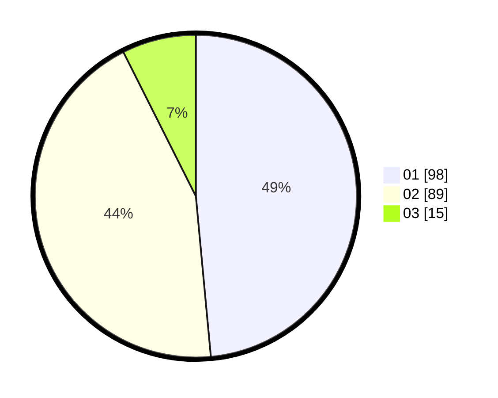

# Hasil

Hasil perolehan suara paslon dapat dilihat pada file paslon-01.txt, paslon-02.txt, dan paslon-03.txt.

Jika tidak ada, artinya data tersebut belum ada pada SIREKAP.

## Perolehan Suara

 * Paslon 01: **98**.
 * Paslon 02: **89**.
 * Paslon 03: **15**.

## Foto C Plano

https://sirekap-obj-formc.kpu.go.id/e0d2/pemilu/ppwp/31/71/07/10/03/3171071003020-20240216-101641--e532c90e-9f67-4c67-978f-2a96c873f370.jpg

https://sirekap-obj-formc.kpu.go.id/e0d2/pemilu/ppwp/31/71/07/10/03/3171071003020-20240216-101642--9fcccb88-bc2c-4b96-981f-eacbeac7f4a1.jpg

https://sirekap-obj-formc.kpu.go.id/e0d2/pemilu/ppwp/31/71/07/10/03/3171071003020-20240216-101642--c55fd814-1b97-4227-9da4-1d0e3431812a.jpg

## DATA PEMILIH TETAP

Jumlah pemilih dalam DPT: **259**.
 * L: **125**.
 * P: **134**.

## DATA PENGGUNA HAK PILIH

Jumlah pengguna hak pilih dalam DPT: **201**.
 * L: **92**.
 * P: **109**.

Jumlah pengguna hak pilih dalam DPTb: **1**.
 * L: **0**.
 * P: **1**.

Jumlah pengguna hak pilih dalam DPK: **2**.
 * L: **1**.
 * P: **1**.

Jumlah pengguna hak pilih: **204**.
 * L: **93**.
 * P: **111**.

## JUMLAH SUARA SAH DAN TIDAK SAH

JUMLAH SELURUH SUARA SAH: **202**.

JUMLAH SUARA TIDAK SAH: **2**.

JUMLAH SELURUH SUARA SAH DAN SUARA TIDAK SAH: **204**.
