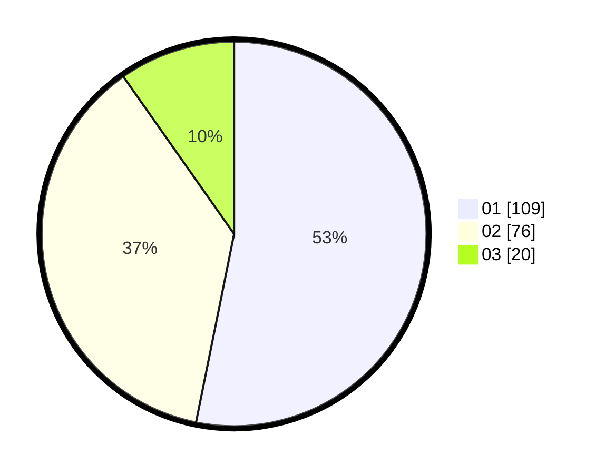

# Hasil

Hasil perolehan suara paslon dapat dilihat pada file paslon-01.txt, paslon-02.txt, dan paslon-03.txt.

Jika tidak ada, artinya data tersebut belum ada pada SIREKAP.

## Perolehan Suara

 * Paslon 01: **109**.
 * Paslon 02: **76**.
 * Paslon 03: **20**.

## Foto C Plano

https://sirekap-obj-formc.kpu.go.id/31b7/pemilu/ppwp/31/71/07/10/03/3171071003021-20240214-194353--9538fe28-ef20-4546-acfb-43fdfcf2d024.jpg

https://sirekap-obj-formc.kpu.go.id/31b7/pemilu/ppwp/31/71/07/10/03/3171071003021-20240214-194403--73722037-9202-44f4-bad5-7a796fd83414.jpg

https://sirekap-obj-formc.kpu.go.id/31b7/pemilu/ppwp/31/71/07/10/03/3171071003021-20240214-194411--16290950-a5f6-40a8-8db5-b4deabb1d656.jpg

## DATA PEMILIH TETAP

Jumlah pemilih dalam DPT: **270**.
 * L: **129**.
 * P: **141**.

## DATA PENGGUNA HAK PILIH

Jumlah pengguna hak pilih dalam DPT: **206**.
 * L: **100**.
 * P: **106**.

Jumlah pengguna hak pilih dalam DPTb: **0**.
 * L: **0**.
 * P: **0**.

Jumlah pengguna hak pilih dalam DPK: **1**.
 * L: **1**.
 * P: **0**.

Jumlah pengguna hak pilih: **207**.
 * L: **101**.
 * P: **106**.

## JUMLAH SUARA SAH DAN TIDAK SAH

JUMLAH SELURUH SUARA SAH: **205**.

JUMLAH SUARA TIDAK SAH: **2**.

JUMLAH SELURUH SUARA SAH DAN SUARA TIDAK SAH: **207**.
