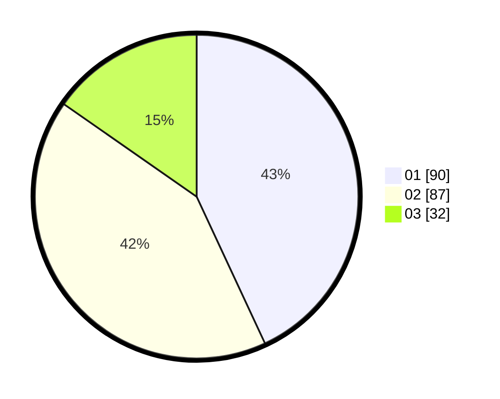

# Hasil

Hasil perolehan suara paslon dapat dilihat pada file paslon-01.txt, paslon-02.txt, dan paslon-03.txt.

Jika tidak ada, artinya data tersebut belum ada pada SIREKAP.

## Perolehan Suara

 * Paslon 01: **90**.
 * Paslon 02: **87**.
 * Paslon 03: **32**.

## Foto C Plano

https://sirekap-obj-formc.kpu.go.id/196f/pemilu/ppwp/31/71/07/10/03/3171071003026-20240216-131841--8fcdc0e1-2f53-4d9c-8119-445845078849.jpg

https://sirekap-obj-formc.kpu.go.id/196f/pemilu/ppwp/31/71/07/10/03/3171071003026-20240216-131842--5b73246d-d313-4b98-95b7-e9714f8e58c5.jpg

https://sirekap-obj-formc.kpu.go.id/196f/pemilu/ppwp/31/71/07/10/03/3171071003026-20240216-131842--32ef7eac-4691-436f-acab-f4ceb1806319.jpg

## DATA PEMILIH TETAP

Jumlah pemilih dalam DPT: **276**.
 * L: **155**.
 * P: **121**.

## DATA PENGGUNA HAK PILIH

Jumlah pengguna hak pilih dalam DPT: **212**.
 * L: **111**.
 * P: **101**.

Jumlah pengguna hak pilih dalam DPTb: **0**.
 * L: **0**.
 * P: **0**.

Jumlah pengguna hak pilih dalam DPK: **0**.
 * L: **0**.
 * P: **0**.

Jumlah pengguna hak pilih: **212**.
 * L: **111**.
 * P: **101**.

## JUMLAH SUARA SAH DAN TIDAK SAH

JUMLAH SELURUH SUARA SAH: **209**.

JUMLAH SUARA TIDAK SAH: **3**.

JUMLAH SELURUH SUARA SAH DAN SUARA TIDAK SAH: **212**.
