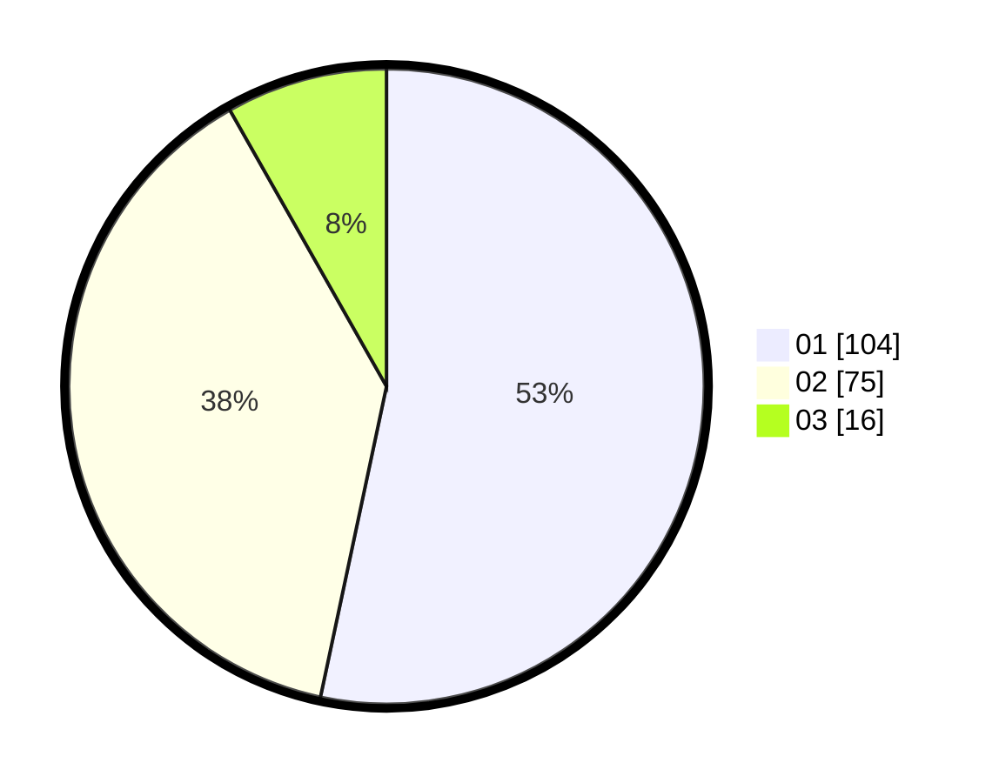

# Hasil

Hasil perolehan suara paslon dapat dilihat pada file paslon-01.txt, paslon-02.txt, dan paslon-03.txt.

Jika tidak ada, artinya data tersebut belum ada pada SIREKAP.

## Perolehan Suara

 * Paslon 01: **104**.
 * Paslon 02: **75**.
 * Paslon 03: **16**.

## Foto C Plano

https://sirekap-obj-formc.kpu.go.id/a360/pemilu/ppwp/31/71/07/10/03/3171071003030-20240216-214320--ad3d5074-df6b-4b0c-8a0d-37027f2d8f94.jpg

https://sirekap-obj-formc.kpu.go.id/a360/pemilu/ppwp/31/71/07/10/03/3171071003030-20240216-215735--9378e238-f948-4d08-b7af-a80a171c1826.jpg
