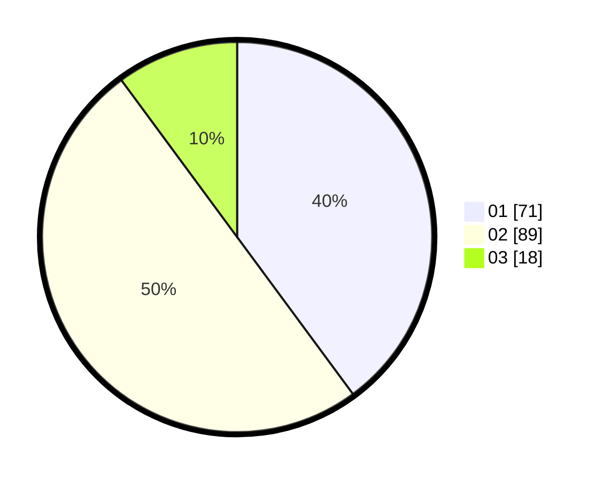

# Hasil

Hasil perolehan suara paslon dapat dilihat pada file paslon-01.txt, paslon-02.txt, dan paslon-03.txt.

Jika tidak ada, artinya data tersebut belum ada pada SIREKAP.

## Perolehan Suara

 * Paslon 01: **71**.
 * Paslon 02: **89**.
 * Paslon 03: **18**.

## Foto C Plano

https://sirekap-obj-formc.kpu.go.id/f988/pemilu/ppwp/31/71/07/10/03/3171071003034-20240217-194542--7f9cd1ad-c32d-4637-8ec8-981dfb67d778.jpg

https://sirekap-obj-formc.kpu.go.id/f988/pemilu/ppwp/31/71/07/10/03/3171071003034-20240217-203957--ca2a04f8-87fd-450a-8c3d-7825ca1cf44e.jpg

https://sirekap-obj-formc.kpu.go.id/f988/pemilu/ppwp/31/71/07/10/03/3171071003034-20240217-203957--deb58632-4095-4803-9bcf-af9311c1ef4e.jpg

## DATA PEMILIH TETAP

Jumlah pemilih dalam DPT: **226**.
 * L: **111**.
 * P: **115**.

## DATA PENGGUNA HAK PILIH

Jumlah pengguna hak pilih dalam DPT: **174**.
 * L: **84**.
 * P: **90**.

Jumlah pengguna hak pilih dalam DPTb: **4**.
 * L: **0**.
 * P: **4**.

Jumlah pengguna hak pilih dalam DPK: **0**.
 * L: **0**.
 * P: **0**.

Jumlah pengguna hak pilih: **178**.
 * L: **84**.
 * P: **94**.

## JUMLAH SUARA SAH DAN TIDAK SAH

JUMLAH SELURUH SUARA SAH: **178**.

JUMLAH SUARA TIDAK SAH: **0**.

JUMLAH SELURUH SUARA SAH DAN SUARA TIDAK SAH: **178**.
