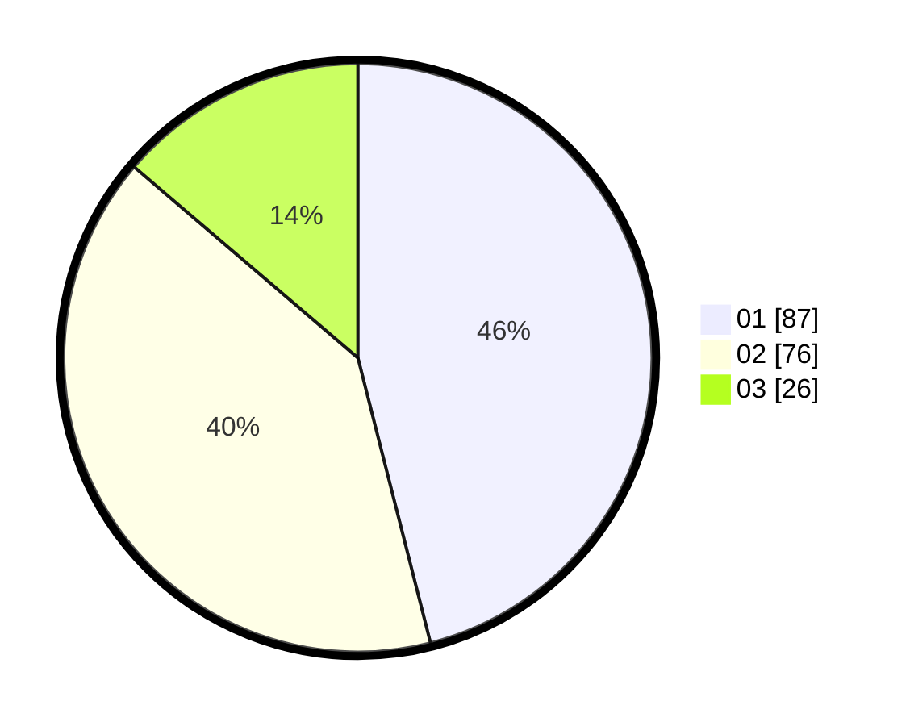

# Hasil

Hasil perolehan suara paslon dapat dilihat pada file paslon-01.txt, paslon-02.txt, dan paslon-03.txt.

Jika tidak ada, artinya data tersebut belum ada pada SIREKAP.

## Perolehan Suara

 * Paslon 01: **87**.
 * Paslon 02: **76**.
 * Paslon 03: **26**.

## Foto C Plano

https://sirekap-obj-formc.kpu.go.id/1836/pemilu/ppwp/31/71/07/10/03/3171071003035-20240214-215335--47eb3d4d-a6f0-4047-8fb8-a7e9af1b0457.jpg

https://sirekap-obj-formc.kpu.go.id/1836/pemilu/ppwp/31/71/07/10/03/3171071003035-20240216-121558--7d6a5949-c5c0-42b0-a154-e083b54df7b8.jpg

https://sirekap-obj-formc.kpu.go.id/1836/pemilu/ppwp/31/71/07/10/03/3171071003035-20240214-191648--f672842f-dc22-4df4-a219-9ce93f37db40.jpg

## DATA PEMILIH TETAP

Jumlah pemilih dalam DPT: **241**.
 * L: **120**.
 * P: **121**.

## DATA PENGGUNA HAK PILIH

Jumlah pengguna hak pilih dalam DPT: **192**.
 * L: **92**.
 * P: **100**.

Jumlah pengguna hak pilih dalam DPTb: **0**.
 * L: **0**.
 * P: **0**.

Jumlah pengguna hak pilih dalam DPK: **2**.
 * L: **1**.
 * P: **1**.

Jumlah pengguna hak pilih: **194**.
 * L: **93**.
 * P: **101**.

## JUMLAH SUARA SAH DAN TIDAK SAH

JUMLAH SELURUH SUARA SAH: **189**.

JUMLAH SUARA TIDAK SAH: **5**.

JUMLAH SELURUH SUARA SAH DAN SUARA TIDAK SAH: **194**.
