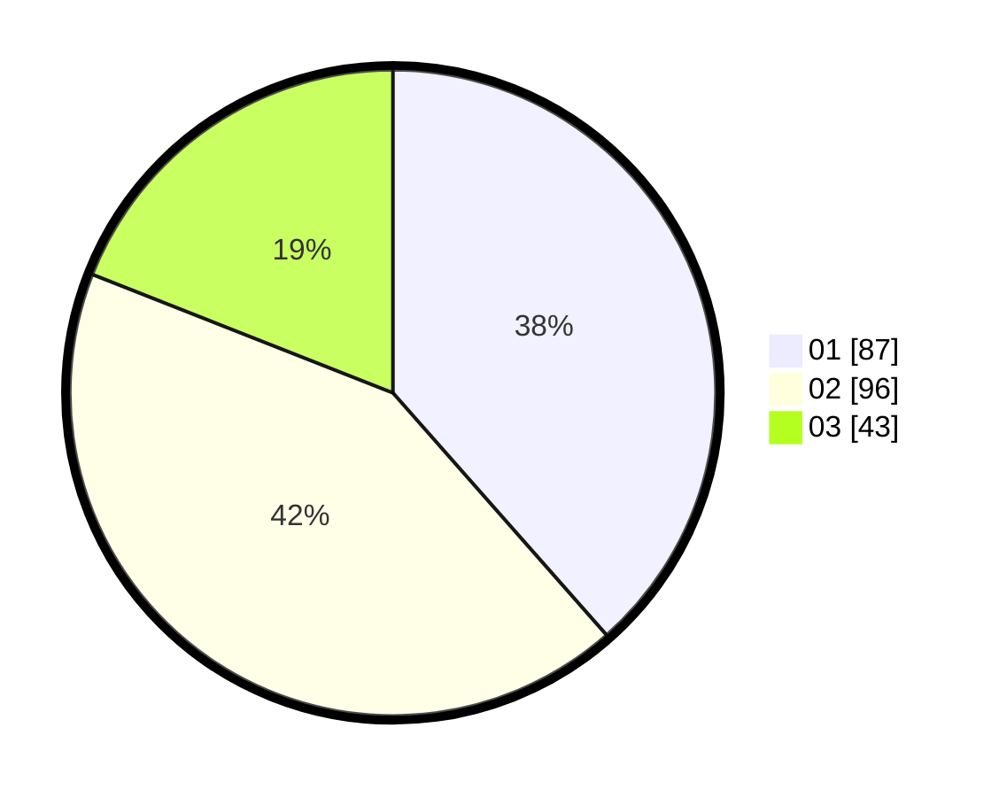

# Hasil

Hasil perolehan suara paslon dapat dilihat pada file paslon-01.txt, paslon-02.txt, dan paslon-03.txt.

Jika tidak ada, artinya data tersebut belum ada pada SIREKAP.

## Perolehan Suara

 * Paslon 01: **87**.
 * Paslon 02: **96**.
 * Paslon 03: **43**.

## Foto C Plano

https://sirekap-obj-formc.kpu.go.id/eb1f/pemilu/ppwp/31/71/07/10/03/3171071003040-20240214-192950--779566e5-35b5-4530-9979-648318c5c729.jpg

https://sirekap-obj-formc.kpu.go.id/eb1f/pemilu/ppwp/31/71/07/10/03/3171071003040-20240215-030642--a12944eb-2500-4f47-a3e7-60685cde5e0e.jpg

https://sirekap-obj-formc.kpu.go.id/eb1f/pemilu/ppwp/31/71/07/10/03/3171071003040-20240215-030810--8f297602-502e-4b42-98c4-206345ce8450.jpg

## DATA PEMILIH TETAP

Jumlah pemilih dalam DPT: **285**.
 * L: **151**.
 * P: **134**.

## DATA PENGGUNA HAK PILIH

Jumlah pengguna hak pilih dalam DPT: **231**.
 * L: **115**.
 * P: **116**.

Jumlah pengguna hak pilih dalam DPTb: **0**.
 * L: **0**.
 * P: **0**.

Jumlah pengguna hak pilih dalam DPK: **2**.
 * L: **2**.
 * P: **0**.

Jumlah pengguna hak pilih: **233**.
 * L: **117**.
 * P: **116**.

## JUMLAH SUARA SAH DAN TIDAK SAH

JUMLAH SELURUH SUARA SAH: **226**.

JUMLAH SUARA TIDAK SAH: **7**.

JUMLAH SELURUH SUARA SAH DAN SUARA TIDAK SAH: **233**.
