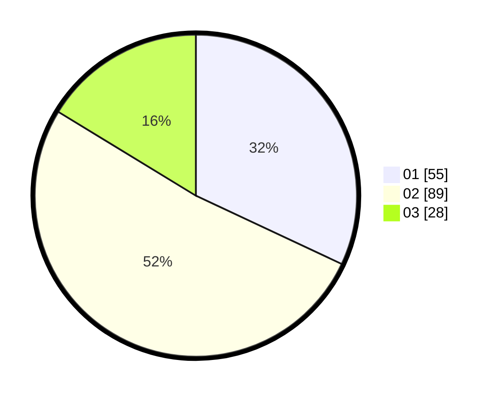

# Hasil

Hasil perolehan suara paslon dapat dilihat pada file paslon-01.txt, paslon-02.txt, dan paslon-03.txt.

Jika tidak ada, artinya data tersebut belum ada pada SIREKAP.

## Perolehan Suara

 * Paslon 01: **55**.
 * Paslon 02: **89**.
 * Paslon 03: **28**.

## Foto C Plano

https://sirekap-obj-formc.kpu.go.id/7b0a/pemilu/ppwp/31/71/07/10/03/3171071003047-20240216-121607--3c5c5f4a-c4e1-40ba-8e45-9cba49860014.jpg

https://sirekap-obj-formc.kpu.go.id/7b0a/pemilu/ppwp/31/71/07/10/03/3171071003047-20240216-121609--baee7386-528c-4cdf-84dd-7139c8d93f3f.jpg

https://sirekap-obj-formc.kpu.go.id/7b0a/pemilu/ppwp/31/71/07/10/03/3171071003047-20240216-121608--d378f3a0-3d67-475c-a74e-6c814889590a.jpg

## DATA PEMILIH TETAP

Jumlah pemilih dalam DPT: **172**.
 * L: **82**.
 * P: **90**.

## DATA PENGGUNA HAK PILIH

Jumlah pengguna hak pilih dalam DPT: **172**.
 * L: **82**.
 * P: **90**.

Jumlah pengguna hak pilih dalam DPTb: **1**.
 * L: **0**.
 * P: **1**.

Jumlah pengguna hak pilih dalam DPK: **1**.
 * L: **0**.
 * P: **1**.

Jumlah pengguna hak pilih: **174**.
 * L: **82**.
 * P: **92**.

## JUMLAH SUARA SAH DAN TIDAK SAH

JUMLAH SELURUH SUARA SAH: **172**.

JUMLAH SUARA TIDAK SAH: **2**.

JUMLAH SELURUH SUARA SAH DAN SUARA TIDAK SAH: **174**.
