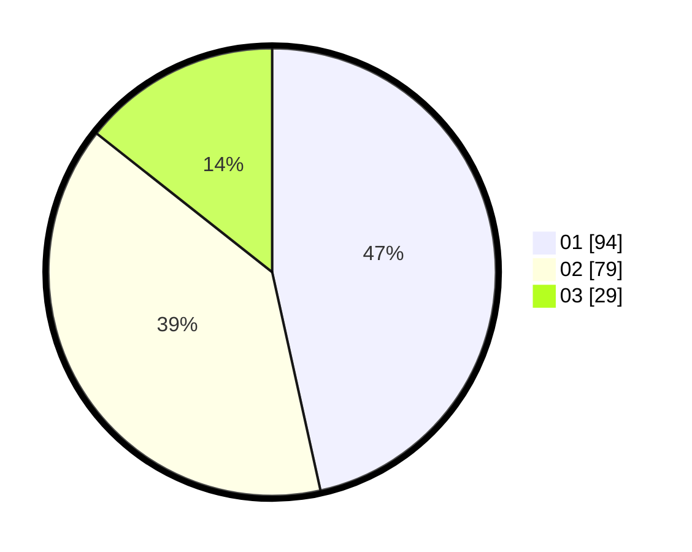

# Hasil

Hasil perolehan suara paslon dapat dilihat pada file paslon-01.txt, paslon-02.txt, dan paslon-03.txt.

Jika tidak ada, artinya data tersebut belum ada pada SIREKAP.

## Perolehan Suara

 * Paslon 01: **94**.
 * Paslon 02: **79**.
 * Paslon 03: **29**.

## Foto C Plano

https://sirekap-obj-formc.kpu.go.id/95e4/pemilu/ppwp/31/71/07/10/03/3171071003048-20240214-215310--60b14009-568d-4e19-9d59-86601ee1c510.jpg

https://sirekap-obj-formc.kpu.go.id/95e4/pemilu/ppwp/31/71/07/10/03/3171071003048-20240214-215745--968a1bcb-5c1c-463f-a469-5b938fea9aa5.jpg

https://sirekap-obj-formc.kpu.go.id/95e4/pemilu/ppwp/31/71/07/10/03/3171071003048-20240214-220142--cb3534b3-7b7c-4587-8139-4e4842593574.jpg

## DATA PEMILIH TETAP

Jumlah pemilih dalam DPT: **267**.
 * L: **137**.
 * P: **130**.

## DATA PENGGUNA HAK PILIH

Jumlah pengguna hak pilih dalam DPT: **201**.
 * L: **101**.
 * P: **100**.

Jumlah pengguna hak pilih dalam DPTb: **1**.
 * L: **0**.
 * P: **1**.

Jumlah pengguna hak pilih dalam DPK: **3**.
 * L: **2**.
 * P: **1**.

Jumlah pengguna hak pilih: **205**.
 * L: **103**.
 * P: **102**.

## JUMLAH SUARA SAH DAN TIDAK SAH

JUMLAH SELURUH SUARA SAH: **202**.

JUMLAH SUARA TIDAK SAH: **3**.

JUMLAH SELURUH SUARA SAH DAN SUARA TIDAK SAH: **205**.
