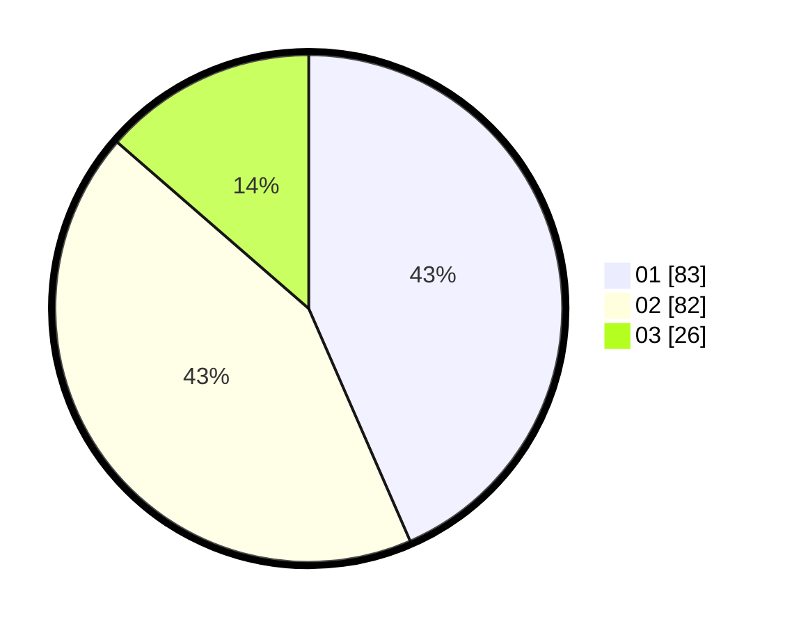

# Hasil

Hasil perolehan suara paslon dapat dilihat pada file paslon-01.txt, paslon-02.txt, dan paslon-03.txt.

Jika tidak ada, artinya data tersebut belum ada pada SIREKAP.

## Perolehan Suara

 * Paslon 01: **83**.
 * Paslon 02: **82**.
 * Paslon 03: **26**.

## Foto C Plano

https://sirekap-obj-formc.kpu.go.id/0ef4/pemilu/ppwp/31/71/07/10/03/3171071003050-20240214-230143--276ddab7-166d-40c6-b8a6-13917354856a.jpg

https://sirekap-obj-formc.kpu.go.id/0ef4/pemilu/ppwp/31/71/07/10/03/3171071003050-20240214-230306--2c53d67d-7c30-43e2-ab80-de103035cff9.jpg

https://sirekap-obj-formc.kpu.go.id/0ef4/pemilu/ppwp/31/71/07/10/03/3171071003050-20240214-230413--2584a651-ed19-4a19-81e5-7dd70db92f5b.jpg

## DATA PEMILIH TETAP

Jumlah pemilih dalam DPT: **242**.
 * L: **126**.
 * P: **116**.

## DATA PENGGUNA HAK PILIH

Jumlah pengguna hak pilih dalam DPT: **188**.
 * L: **95**.
 * P: **93**.

Jumlah pengguna hak pilih dalam DPTb: **0**.
 * L: **0**.
 * P: **0**.

Jumlah pengguna hak pilih dalam DPK: **5**.
 * L: **3**.
 * P: **2**.

Jumlah pengguna hak pilih: **193**.
 * L: **98**.
 * P: **95**.

## JUMLAH SUARA SAH DAN TIDAK SAH

JUMLAH SELURUH SUARA SAH: **191**.

JUMLAH SUARA TIDAK SAH: **2**.

JUMLAH SELURUH SUARA SAH DAN SUARA TIDAK SAH: **193**.
