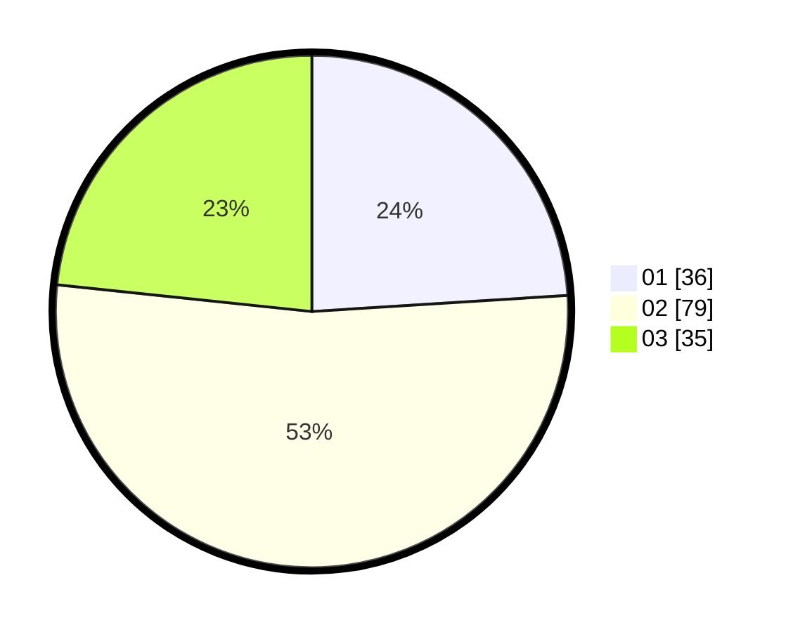

# Hasil

Hasil perolehan suara paslon dapat dilihat pada file paslon-01.txt, paslon-02.txt, dan paslon-03.txt.

Jika tidak ada, artinya data tersebut belum ada pada SIREKAP.

## Perolehan Suara

 * Paslon 01: **36**.
 * Paslon 02: **79**.
 * Paslon 03: **35**.

## Foto C Plano

https://sirekap-obj-formc.kpu.go.id/0105/pemilu/ppwp/31/71/07/10/03/3171071003059-20240214-190846--661959de-3cfe-4cad-a5d4-ad3c764a1dc8.jpg

https://sirekap-obj-formc.kpu.go.id/0105/pemilu/ppwp/31/71/07/10/03/3171071003059-20240214-195930--036cd880-4a71-4f4e-81a8-b172947a61b9.jpg

https://sirekap-obj-formc.kpu.go.id/0105/pemilu/ppwp/31/71/07/10/03/3171071003059-20240217-082059--e0a406c4-7723-4684-9dc5-83546e9f8713.jpg

## DATA PEMILIH TETAP

Jumlah pemilih dalam DPT: **227**.
 * L: **115**.
 * P: **112**.

## DATA PENGGUNA HAK PILIH

Jumlah pengguna hak pilih dalam DPT: **136**.
 * L: **65**.
 * P: **71**.

Jumlah pengguna hak pilih dalam DPTb: **14**.
 * L: **9**.
 * P: **5**.

Jumlah pengguna hak pilih dalam DPK: **2**.
 * L: **1**.
 * P: **1**.

Jumlah pengguna hak pilih: **152**.
 * L: **75**.
 * P: **77**.

## JUMLAH SUARA SAH DAN TIDAK SAH

JUMLAH SELURUH SUARA SAH: **150**.

JUMLAH SUARA TIDAK SAH: **2**.

JUMLAH SELURUH SUARA SAH DAN SUARA TIDAK SAH: **152**.
