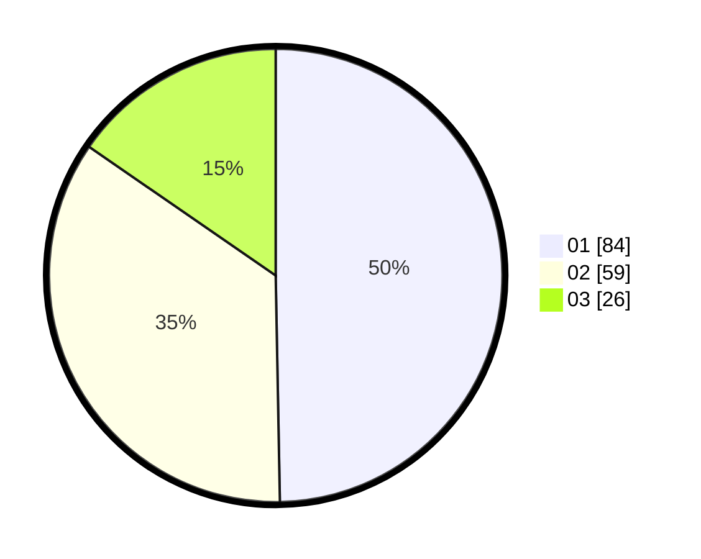

# Hasil

Hasil perolehan suara paslon dapat dilihat pada file paslon-01.txt, paslon-02.txt, dan paslon-03.txt.

Jika tidak ada, artinya data tersebut belum ada pada SIREKAP.

## Perolehan Suara

 * Paslon 01: **84**.
 * Paslon 02: **59**.
 * Paslon 03: **26**.

## Foto C Plano

https://sirekap-obj-formc.kpu.go.id/ed9f/pemilu/ppwp/31/71/07/10/03/3171071003065-20240214-155831--9e4de7f7-5a30-4eb1-b56c-916ef7105b91.jpg

https://sirekap-obj-formc.kpu.go.id/ed9f/pemilu/ppwp/31/71/07/10/03/3171071003065-20240214-155854--85c1c30b-bdd2-4882-8eb9-be2a1b4c1f35.jpg

https://sirekap-obj-formc.kpu.go.id/ed9f/pemilu/ppwp/31/71/07/10/03/3171071003065-20240214-155902--5620c39f-7964-4f13-8cc1-852dc2e247b8.jpg

## DATA PEMILIH TETAP

Jumlah pemilih dalam DPT: **219**.
 * L: **107**.
 * P: **112**.

## DATA PENGGUNA HAK PILIH

Jumlah pengguna hak pilih dalam DPT: **157**.
 * L: **72**.
 * P: **85**.

Jumlah pengguna hak pilih dalam DPTb: **12**.
 * L: **4**.
 * P: **8**.

Jumlah pengguna hak pilih dalam DPK: **0**.
 * L: **0**.
 * P: **0**.

Jumlah pengguna hak pilih: **169**.
 * L: **76**.
 * P: **93**.

## JUMLAH SUARA SAH DAN TIDAK SAH

JUMLAH SELURUH SUARA SAH: **169**.

JUMLAH SUARA TIDAK SAH: **0**.

JUMLAH SELURUH SUARA SAH DAN SUARA TIDAK SAH: **169**.
