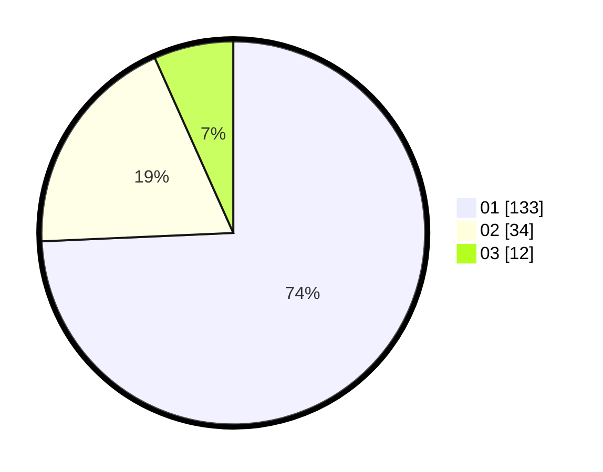

# Hasil

Hasil perolehan suara paslon dapat dilihat pada file paslon-01.txt, paslon-02.txt, dan paslon-03.txt.

Jika tidak ada, artinya data tersebut belum ada pada SIREKAP.

## Perolehan Suara

 * Paslon 01: **133**.
 * Paslon 02: **34**.
 * Paslon 03: **12**.

## Foto C Plano

https://sirekap-obj-formc.kpu.go.id/b083/pemilu/ppwp/31/71/07/10/04/3171071004014-20240214-234626--fe86666a-ee97-4c74-be8b-9e8c0c3f3f3f.jpg

https://sirekap-obj-formc.kpu.go.id/b083/pemilu/ppwp/31/71/07/10/04/3171071004014-20240214-234749--0bb8e841-0ce9-46e4-8c30-e70b5a3747c5.jpg

https://sirekap-obj-formc.kpu.go.id/b083/pemilu/ppwp/31/71/07/10/04/3171071004014-20240214-234915--0197f71e-9b11-4d77-b1b3-d7a794ef1aeb.jpg

## DATA PEMILIH TETAP

Jumlah pemilih dalam DPT: **271**.
 * L: **148**.
 * P: **123**.

## DATA PENGGUNA HAK PILIH

Jumlah pengguna hak pilih dalam DPT: **179**.
 * L: **92**.
 * P: **87**.

Jumlah pengguna hak pilih dalam DPTb: **1**.
 * L: **1**.
 * P: **0**.

Jumlah pengguna hak pilih dalam DPK: **3**.
 * L: **1**.
 * P: **2**.

Jumlah pengguna hak pilih: **183**.
 * L: **94**.
 * P: **89**.

## JUMLAH SUARA SAH DAN TIDAK SAH

JUMLAH SELURUH SUARA SAH: **179**.

JUMLAH SUARA TIDAK SAH: **4**.

JUMLAH SELURUH SUARA SAH DAN SUARA TIDAK SAH: **183**.
