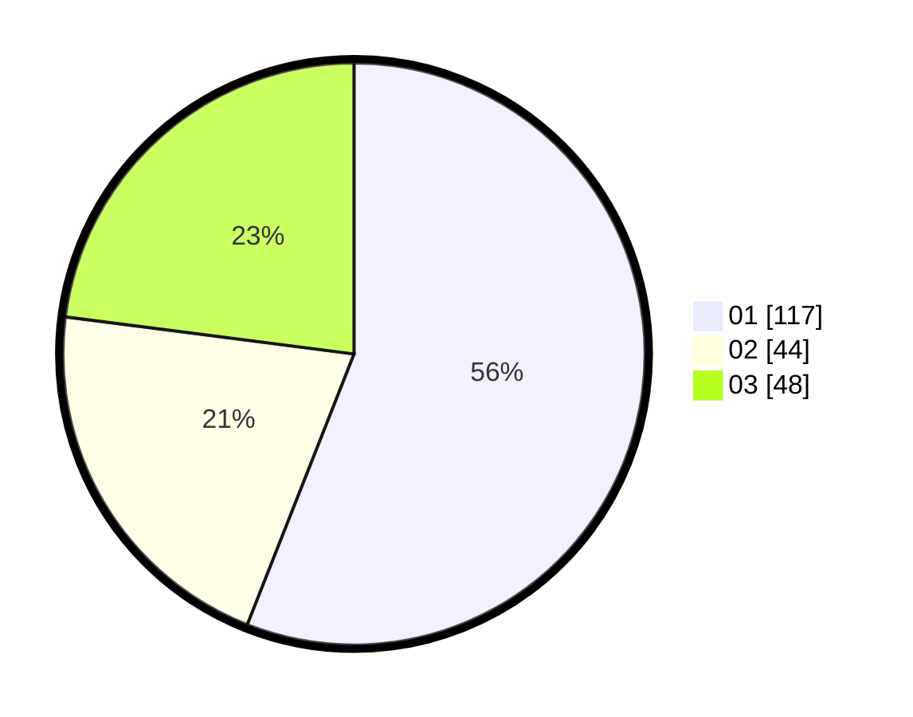

# Hasil

Hasil perolehan suara paslon dapat dilihat pada file paslon-01.txt, paslon-02.txt, dan paslon-03.txt.

Jika tidak ada, artinya data tersebut belum ada pada SIREKAP.

## Perolehan Suara

 * Paslon 01: **117**.
 * Paslon 02: **44**.
 * Paslon 03: **48**.

## Foto C Plano

https://sirekap-obj-formc.kpu.go.id/61e4/pemilu/ppwp/31/71/07/10/04/3171071004016-20240214-190554--9515ed13-cffe-4dd3-9f4c-6411c6ba69de.jpg

https://sirekap-obj-formc.kpu.go.id/61e4/pemilu/ppwp/31/71/07/10/04/3171071004016-20240214-191257--7e709bfb-b893-41f5-b535-d8e20d78ff89.jpg

https://sirekap-obj-formc.kpu.go.id/61e4/pemilu/ppwp/31/71/07/10/04/3171071004016-20240214-191552--5ceae057-0a7c-4c01-b717-4d31df08f38d.jpg

## DATA PEMILIH TETAP

Jumlah pemilih dalam DPT: **278**.
 * L: **144**.
 * P: **134**.

## DATA PENGGUNA HAK PILIH

Jumlah pengguna hak pilih dalam DPT: **204**.
 * L: **99**.
 * P: **105**.

Jumlah pengguna hak pilih dalam DPTb: **4**.
 * L: **2**.
 * P: **2**.

Jumlah pengguna hak pilih dalam DPK: **4**.
 * L: **2**.
 * P: **2**.

Jumlah pengguna hak pilih: **212**.
 * L: **103**.
 * P: **109**.

## JUMLAH SUARA SAH DAN TIDAK SAH

JUMLAH SELURUH SUARA SAH: **209**.

JUMLAH SUARA TIDAK SAH: **3**.

JUMLAH SELURUH SUARA SAH DAN SUARA TIDAK SAH: **212**.
