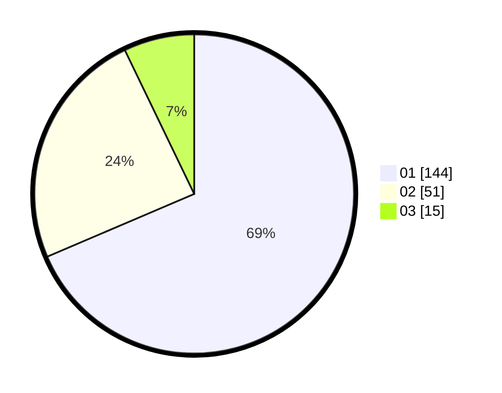

# Hasil

Hasil perolehan suara paslon dapat dilihat pada file paslon-01.txt, paslon-02.txt, dan paslon-03.txt.

Jika tidak ada, artinya data tersebut belum ada pada SIREKAP.

## Perolehan Suara

 * Paslon 01: **144**.
 * Paslon 02: **51**.
 * Paslon 03: **15**.

## Foto C Plano

https://sirekap-obj-formc.kpu.go.id/c715/pemilu/ppwp/31/71/07/10/04/3171071004018-20240215-201352--3b7de570-625b-40a8-a596-11b2eb9ac9ae.jpg

https://sirekap-obj-formc.kpu.go.id/c715/pemilu/ppwp/31/71/07/10/04/3171071004018-20240215-201415--c3f17277-0f00-4ed2-801f-e98c9e4a94b3.jpg

https://sirekap-obj-formc.kpu.go.id/c715/pemilu/ppwp/31/71/07/10/04/3171071004018-20240215-201404--169df943-20fe-4fa2-a4b1-eb26b446d66b.jpg

## DATA PEMILIH TETAP

Jumlah pemilih dalam DPT: **283**.
 * L: **137**.
 * P: **146**.

## DATA PENGGUNA HAK PILIH

Jumlah pengguna hak pilih dalam DPT: **204**.
 * L: **92**.
 * P: **112**.

Jumlah pengguna hak pilih dalam DPTb: **4**.
 * L: **2**.
 * P: **2**.

Jumlah pengguna hak pilih dalam DPK: **5**.
 * L: **1**.
 * P: **4**.

Jumlah pengguna hak pilih: **213**.
 * L: **95**.
 * P: **118**.

## JUMLAH SUARA SAH DAN TIDAK SAH

JUMLAH SELURUH SUARA SAH: **210**.

JUMLAH SUARA TIDAK SAH: **3**.

JUMLAH SELURUH SUARA SAH DAN SUARA TIDAK SAH: **213**.
