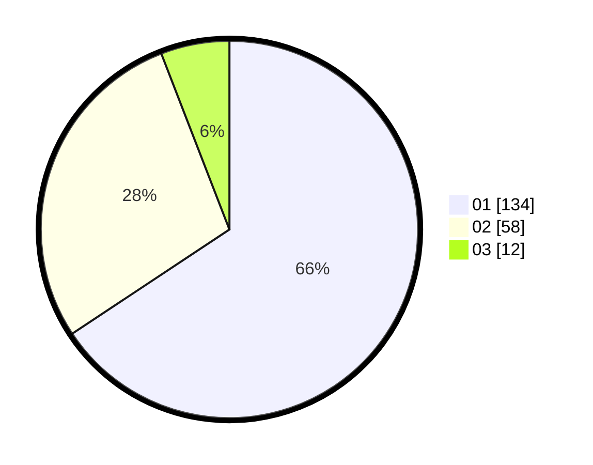

# Hasil

Hasil perolehan suara paslon dapat dilihat pada file paslon-01.txt, paslon-02.txt, dan paslon-03.txt.

Jika tidak ada, artinya data tersebut belum ada pada SIREKAP.

## Perolehan Suara

 * Paslon 01: **134**.
 * Paslon 02: **58**.
 * Paslon 03: **12**.

## Foto C Plano

https://sirekap-obj-formc.kpu.go.id/6b93/pemilu/ppwp/31/71/07/10/04/3171071004020-20240215-004435--449e072d-3355-4e02-abfb-ed90ab4f9722.jpg

https://sirekap-obj-formc.kpu.go.id/6b93/pemilu/ppwp/31/71/07/10/04/3171071004020-20240215-004436--e434b33b-7065-4a32-b578-384f978bdfd3.jpg

https://sirekap-obj-formc.kpu.go.id/6b93/pemilu/ppwp/31/71/07/10/04/3171071004020-20240215-004436--39167b57-fa74-4731-93d2-213e18b9e747.jpg

## DATA PEMILIH TETAP

Jumlah pemilih dalam DPT: **283**.
 * L: **138**.
 * P: **145**.

## DATA PENGGUNA HAK PILIH

Jumlah pengguna hak pilih dalam DPT: **207**.
 * L: **99**.
 * P: **108**.

Jumlah pengguna hak pilih dalam DPTb: **1**.
 * L: **0**.
 * P: **1**.

Jumlah pengguna hak pilih dalam DPK: **1**.
 * L: **0**.
 * P: **1**.

Jumlah pengguna hak pilih: **209**.
 * L: **99**.
 * P: **110**.

## JUMLAH SUARA SAH DAN TIDAK SAH

JUMLAH SELURUH SUARA SAH: **204**.

JUMLAH SUARA TIDAK SAH: **5**.

JUMLAH SELURUH SUARA SAH DAN SUARA TIDAK SAH: **209**.
