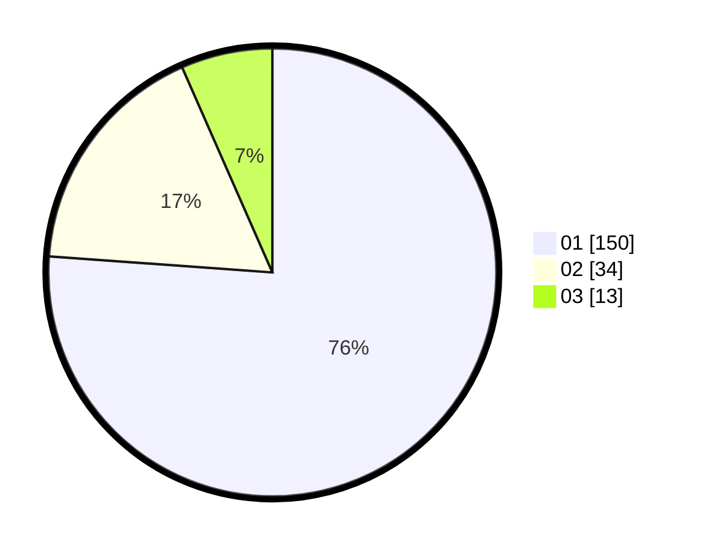

# Hasil

Hasil perolehan suara paslon dapat dilihat pada file paslon-01.txt, paslon-02.txt, dan paslon-03.txt.

Jika tidak ada, artinya data tersebut belum ada pada SIREKAP.

## Perolehan Suara

 * Paslon 01: **150**.
 * Paslon 02: **34**.
 * Paslon 03: **13**.

## Foto C Plano

https://sirekap-obj-formc.kpu.go.id/51b7/pemilu/ppwp/31/71/07/10/04/3171071004025-20240216-164708--12200074-2f77-44ca-b0e6-b72bacf55d6b.jpg

https://sirekap-obj-formc.kpu.go.id/51b7/pemilu/ppwp/31/71/07/10/04/3171071004025-20240216-164709--311b3f68-f579-49c6-b741-83ab7a840cdc.jpg

https://sirekap-obj-formc.kpu.go.id/51b7/pemilu/ppwp/31/71/07/10/04/3171071004025-20240216-164708--2e6c913a-594b-457f-b794-7ef89675b3e3.jpg

## DATA PEMILIH TETAP

Jumlah pemilih dalam DPT: **261**.
 * L: **129**.
 * P: **132**.

## DATA PENGGUNA HAK PILIH

Jumlah pengguna hak pilih dalam DPT: **261**.
 * L: **129**.
 * P: **132**.

Jumlah pengguna hak pilih dalam DPTb: **0**.
 * L: **0**.
 * P: **0**.

Jumlah pengguna hak pilih dalam DPK: **0**.
 * L: **0**.
 * P: **0**.

Jumlah pengguna hak pilih: **261**.
 * L: **129**.
 * P: **132**.

## JUMLAH SUARA SAH DAN TIDAK SAH

JUMLAH SELURUH SUARA SAH: **197**.

JUMLAH SUARA TIDAK SAH: **0**.

JUMLAH SELURUH SUARA SAH DAN SUARA TIDAK SAH: **197**.
