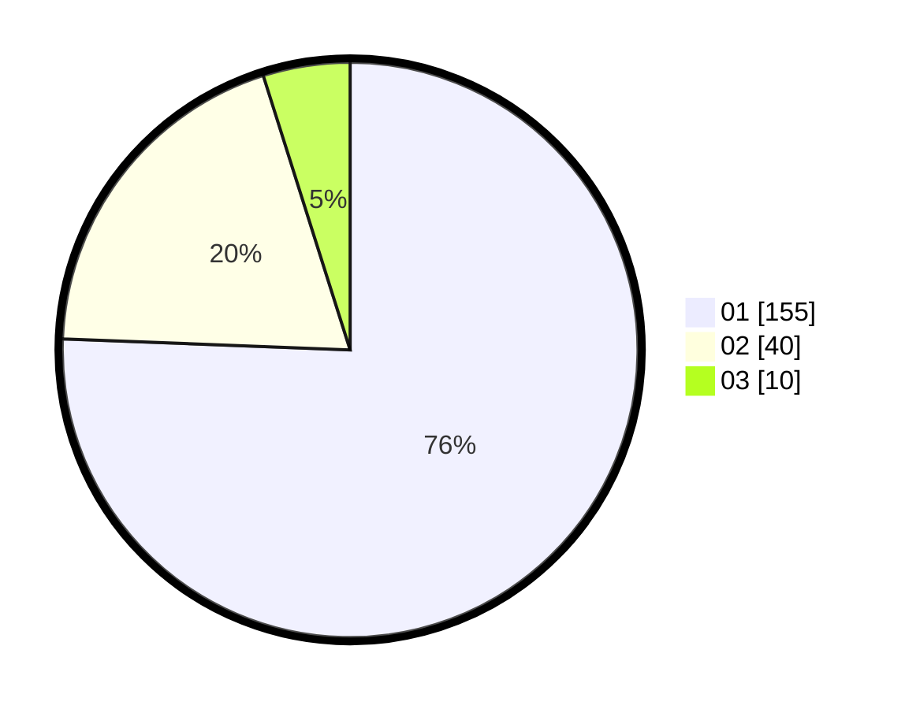

# Hasil

Hasil perolehan suara paslon dapat dilihat pada file paslon-01.txt, paslon-02.txt, dan paslon-03.txt.

Jika tidak ada, artinya data tersebut belum ada pada SIREKAP.

## Perolehan Suara

 * Paslon 01: **155**.
 * Paslon 02: **40**.
 * Paslon 03: **10**.

## Foto C Plano

https://sirekap-obj-formc.kpu.go.id/e050/pemilu/ppwp/31/71/07/10/04/3171071004028-20240216-004744--95f41978-2063-4f34-9d5f-859c62f81997.jpg

https://sirekap-obj-formc.kpu.go.id/e050/pemilu/ppwp/31/71/07/10/04/3171071004028-20240216-004749--486b85b7-3fd1-4a8a-a51b-93774a597721.jpg

https://sirekap-obj-formc.kpu.go.id/e050/pemilu/ppwp/31/71/07/10/04/3171071004028-20240216-004747--5ba2beb4-e7af-49f5-bbf9-b99b57f0b5a7.jpg

## DATA PEMILIH TETAP

Jumlah pemilih dalam DPT: **0**.
 * L: **0**.
 * P: **0**.

## DATA PENGGUNA HAK PILIH

Jumlah pengguna hak pilih dalam DPT: **0**.
 * L: **0**.
 * P: **0**.

Jumlah pengguna hak pilih dalam DPTb: **0**.
 * L: **0**.
 * P: **0**.

Jumlah pengguna hak pilih dalam DPK: **0**.
 * L: **0**.
 * P: **0**.

Jumlah pengguna hak pilih: **0**.
 * L: **0**.
 * P: **0**.

## JUMLAH SUARA SAH DAN TIDAK SAH

JUMLAH SELURUH SUARA SAH: **205**.

JUMLAH SUARA TIDAK SAH: **0**.

JUMLAH SELURUH SUARA SAH DAN SUARA TIDAK SAH: **205**.
