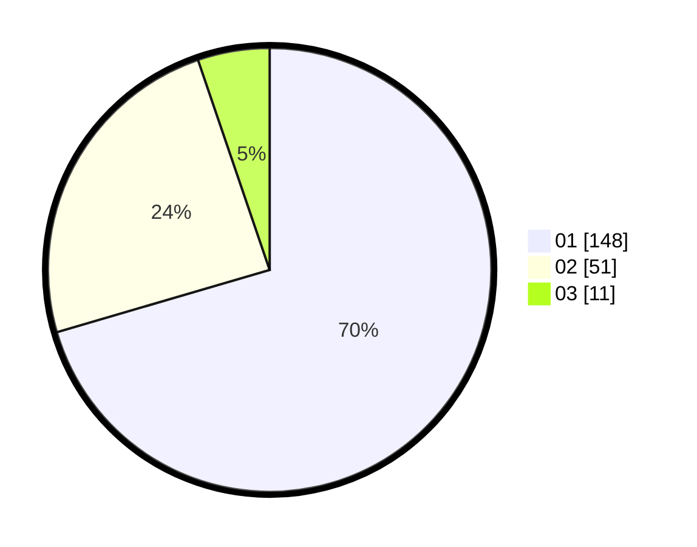

# Hasil

Hasil perolehan suara paslon dapat dilihat pada file paslon-01.txt, paslon-02.txt, dan paslon-03.txt.

Jika tidak ada, artinya data tersebut belum ada pada SIREKAP.

## Perolehan Suara

 * Paslon 01: **148**.
 * Paslon 02: **51**.
 * Paslon 03: **11**.

## Foto C Plano

https://sirekap-obj-formc.kpu.go.id/b064/pemilu/ppwp/31/71/07/10/04/3171071004031-20240214-190800--958e99bc-9069-4f88-8a27-1e2c451dda62.jpg

https://sirekap-obj-formc.kpu.go.id/b064/pemilu/ppwp/31/71/07/10/04/3171071004031-20240214-211810--abae2e9b-59a4-4581-b971-b4473111be37.jpg

https://sirekap-obj-formc.kpu.go.id/b064/pemilu/ppwp/31/71/07/10/04/3171071004031-20240214-190837--517472c1-d436-4342-b789-1a50c48f0b0b.jpg

## DATA PEMILIH TETAP

Jumlah pemilih dalam DPT: **266**.
 * L: **130**.
 * P: **136**.

## DATA PENGGUNA HAK PILIH

Jumlah pengguna hak pilih dalam DPT: **206**.
 * L: **101**.
 * P: **105**.

Jumlah pengguna hak pilih dalam DPTb: **0**.
 * L: **0**.
 * P: **0**.

Jumlah pengguna hak pilih dalam DPK: **3**.
 * L: **1**.
 * P: **2**.

Jumlah pengguna hak pilih: **209**.
 * L: **102**.
 * P: **107**.

## JUMLAH SUARA SAH DAN TIDAK SAH

JUMLAH SELURUH SUARA SAH: **210**.

JUMLAH SUARA TIDAK SAH: **1**.

JUMLAH SELURUH SUARA SAH DAN SUARA TIDAK SAH: **211**.
