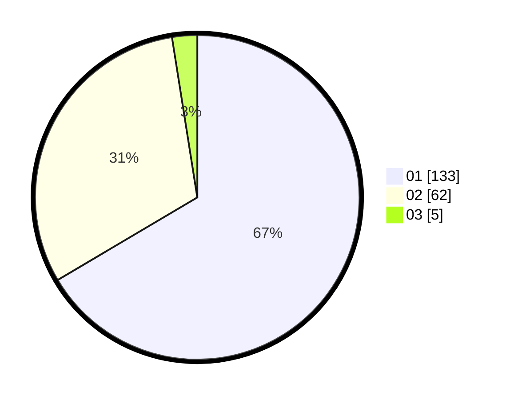

# Hasil

Hasil perolehan suara paslon dapat dilihat pada file paslon-01.txt, paslon-02.txt, dan paslon-03.txt.

Jika tidak ada, artinya data tersebut belum ada pada SIREKAP.

## Perolehan Suara

 * Paslon 01: **133**.
 * Paslon 02: **62**.
 * Paslon 03: **5**.

## Foto C Plano

https://sirekap-obj-formc.kpu.go.id/5e97/pemilu/ppwp/31/71/07/10/04/3171071004040-20240214-210359--bd092502-2d7a-4675-862f-0a1da6c7fd05.jpg

https://sirekap-obj-formc.kpu.go.id/5e97/pemilu/ppwp/31/71/07/10/04/3171071004040-20240214-210502--9638c7cf-db9c-4b9d-9c35-f5c016cb1404.jpg

https://sirekap-obj-formc.kpu.go.id/5e97/pemilu/ppwp/31/71/07/10/04/3171071004040-20240214-210607--6228a9bb-dd56-4d96-86e9-4b5d88e903de.jpg
