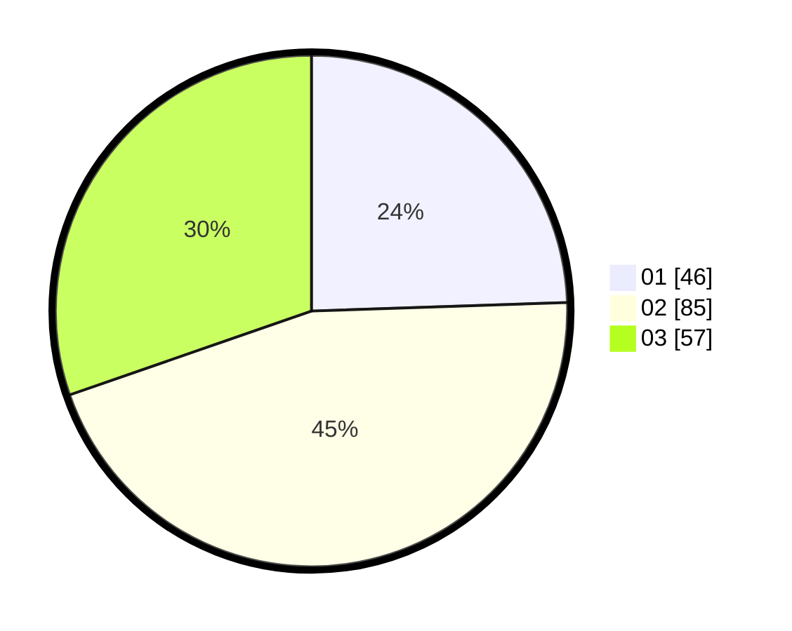

# Hasil

Hasil perolehan suara paslon dapat dilihat pada file paslon-01.txt, paslon-02.txt, dan paslon-03.txt.

Jika tidak ada, artinya data tersebut belum ada pada SIREKAP.

## Perolehan Suara

 * Paslon 01: **46**.
 * Paslon 02: **85**.
 * Paslon 03: **57**.

## Foto C Plano

https://sirekap-obj-formc.kpu.go.id/6a48/pemilu/ppwp/31/71/07/10/04/3171071004046-20240214-185211--549c9686-dfd5-4180-b76a-55e4037a330b.jpg

https://sirekap-obj-formc.kpu.go.id/6a48/pemilu/ppwp/31/71/07/10/04/3171071004046-20240214-185414--5b13d008-3ec4-4c28-a730-c371b107c087.jpg

https://sirekap-obj-formc.kpu.go.id/6a48/pemilu/ppwp/31/71/07/10/04/3171071004046-20240214-185735--7324490b-f519-46f8-96e1-68ef0430e0ec.jpg

## DATA PEMILIH TETAP

Jumlah pemilih dalam DPT: **234**.
 * L: **110**.
 * P: **124**.

## DATA PENGGUNA HAK PILIH

Jumlah pengguna hak pilih dalam DPT: **0**.
 * L: **0**.
 * P: **0**.

Jumlah pengguna hak pilih dalam DPTb: **0**.
 * L: **0**.
 * P: **0**.

Jumlah pengguna hak pilih dalam DPK: **0**.
 * L: **0**.
 * P: **0**.

Jumlah pengguna hak pilih: **0**.
 * L: **0**.
 * P: **0**.

## JUMLAH SUARA SAH DAN TIDAK SAH

JUMLAH SELURUH SUARA SAH: **186**.

JUMLAH SUARA TIDAK SAH: **2**.

JUMLAH SELURUH SUARA SAH DAN SUARA TIDAK SAH: **188**.
