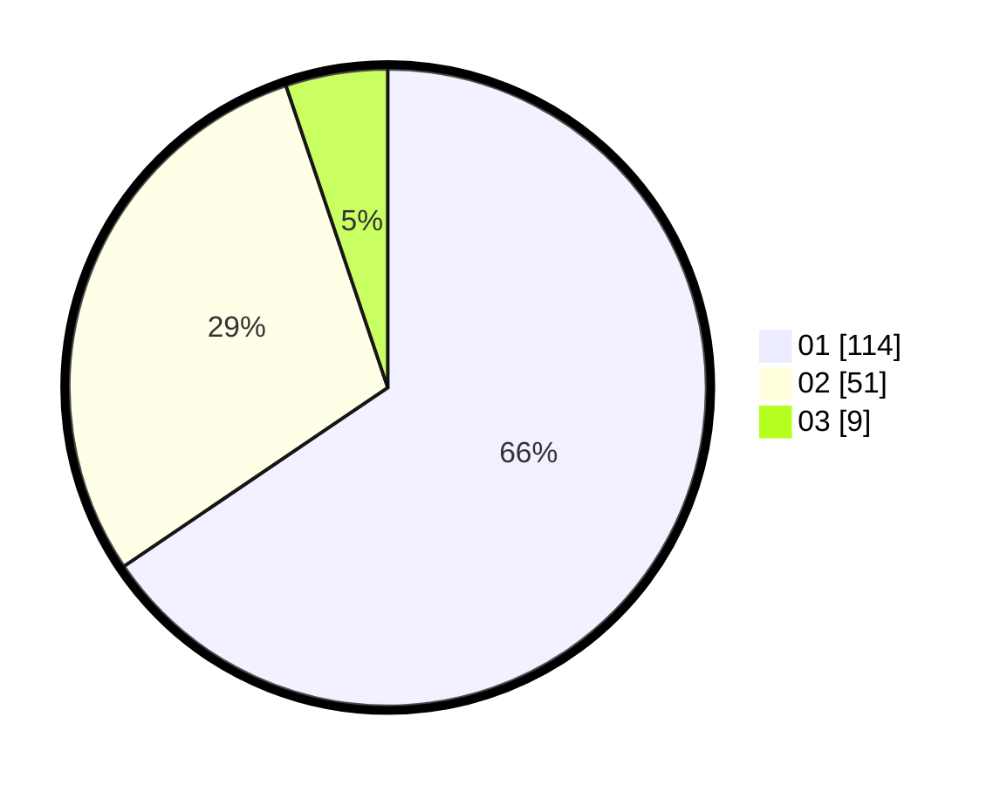

# Hasil

Hasil perolehan suara paslon dapat dilihat pada file paslon-01.txt, paslon-02.txt, dan paslon-03.txt.

Jika tidak ada, artinya data tersebut belum ada pada SIREKAP.

## Perolehan Suara

 * Paslon 01: **114**.
 * Paslon 02: **51**.
 * Paslon 03: **9**.

## Foto C Plano

https://sirekap-obj-formc.kpu.go.id/667a/pemilu/ppwp/31/71/07/10/04/3171071004055-20240214-205519--cc57906c-9049-49a3-97eb-5e71b5a8b4f7.jpg

https://sirekap-obj-formc.kpu.go.id/667a/pemilu/ppwp/31/71/07/10/04/3171071004055-20240214-205558--bb730885-dfe1-4b9c-a9b5-c9a484caa3a4.jpg

https://sirekap-obj-formc.kpu.go.id/667a/pemilu/ppwp/31/71/07/10/04/3171071004055-20240214-205651--e971e9c9-b039-435b-9714-5d2bddf484bc.jpg
