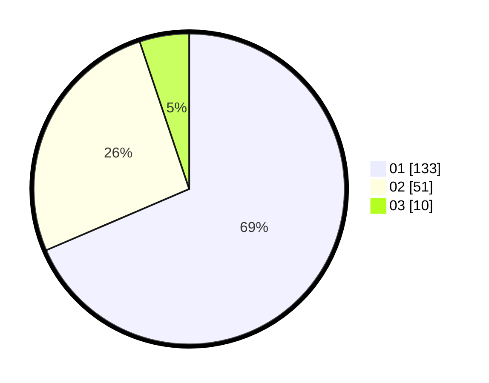

# Hasil

Hasil perolehan suara paslon dapat dilihat pada file paslon-01.txt, paslon-02.txt, dan paslon-03.txt.

Jika tidak ada, artinya data tersebut belum ada pada SIREKAP.

## Perolehan Suara

 * Paslon 01: **133**.
 * Paslon 02: **51**.
 * Paslon 03: **10**.

## Foto C Plano

https://sirekap-obj-formc.kpu.go.id/6788/pemilu/ppwp/31/71/07/10/04/3171071004057-20240216-135709--7437255d-8add-49fb-95b7-945cddb77c7d.jpg

https://sirekap-obj-formc.kpu.go.id/6788/pemilu/ppwp/31/71/07/10/04/3171071004057-20240215-153204--f0ccb164-bfe5-4671-9e0a-4d1fbb05dc62.jpg

https://sirekap-obj-formc.kpu.go.id/6788/pemilu/ppwp/31/71/07/10/04/3171071004057-20240215-032811--8bc3baf4-44bb-4b01-9aba-083e61bae84e.jpg

## DATA PEMILIH TETAP

Jumlah pemilih dalam DPT: **270**.
 * L: **134**.
 * P: **136**.

## DATA PENGGUNA HAK PILIH

Jumlah pengguna hak pilih dalam DPT: **188**.
 * L: **90**.
 * P: **98**.

Jumlah pengguna hak pilih dalam DPTb: **6**.
 * L: **0**.
 * P: **6**.

Jumlah pengguna hak pilih dalam DPK: **2**.
 * L: **2**.
 * P: **0**.

Jumlah pengguna hak pilih: **196**.
 * L: **92**.
 * P: **104**.

## JUMLAH SUARA SAH DAN TIDAK SAH

JUMLAH SELURUH SUARA SAH: **194**.

JUMLAH SUARA TIDAK SAH: **2**.

JUMLAH SELURUH SUARA SAH DAN SUARA TIDAK SAH: **196**.
