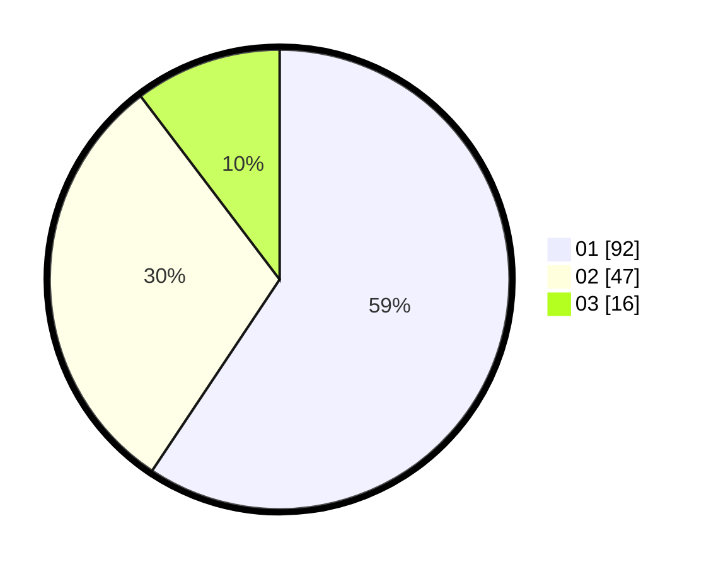

# Hasil

Hasil perolehan suara paslon dapat dilihat pada file paslon-01.txt, paslon-02.txt, dan paslon-03.txt.

Jika tidak ada, artinya data tersebut belum ada pada SIREKAP.

## Perolehan Suara

 * Paslon 01: **92**.
 * Paslon 02: **47**.
 * Paslon 03: **16**.

## Foto C Plano

https://sirekap-obj-formc.kpu.go.id/d221/pemilu/ppwp/31/71/07/10/04/3171071004058-20240215-205704--c5102c0a-ca0a-4858-8a53-05fe003d917c.jpg

https://sirekap-obj-formc.kpu.go.id/d221/pemilu/ppwp/31/71/07/10/04/3171071004058-20240215-205706--c49e4564-1331-458f-8884-61f5db365f93.jpg

https://sirekap-obj-formc.kpu.go.id/d221/pemilu/ppwp/31/71/07/10/04/3171071004058-20240215-205705--86380095-547d-489b-b970-d4938a6b4519.jpg

## DATA PEMILIH TETAP

Jumlah pemilih dalam DPT: **243**.
 * L: **126**.
 * P: **117**.

## DATA PENGGUNA HAK PILIH

Jumlah pengguna hak pilih dalam DPT: **152**.
 * L: **74**.
 * P: **78**.

Jumlah pengguna hak pilih dalam DPTb: **3**.
 * L: **1**.
 * P: **2**.

Jumlah pengguna hak pilih dalam DPK: **1**.
 * L: **0**.
 * P: **1**.

Jumlah pengguna hak pilih: **156**.
 * L: **75**.
 * P: **81**.

## JUMLAH SUARA SAH DAN TIDAK SAH

JUMLAH SELURUH SUARA SAH: **155**.

JUMLAH SUARA TIDAK SAH: **1**.

JUMLAH SELURUH SUARA SAH DAN SUARA TIDAK SAH: **156**.
