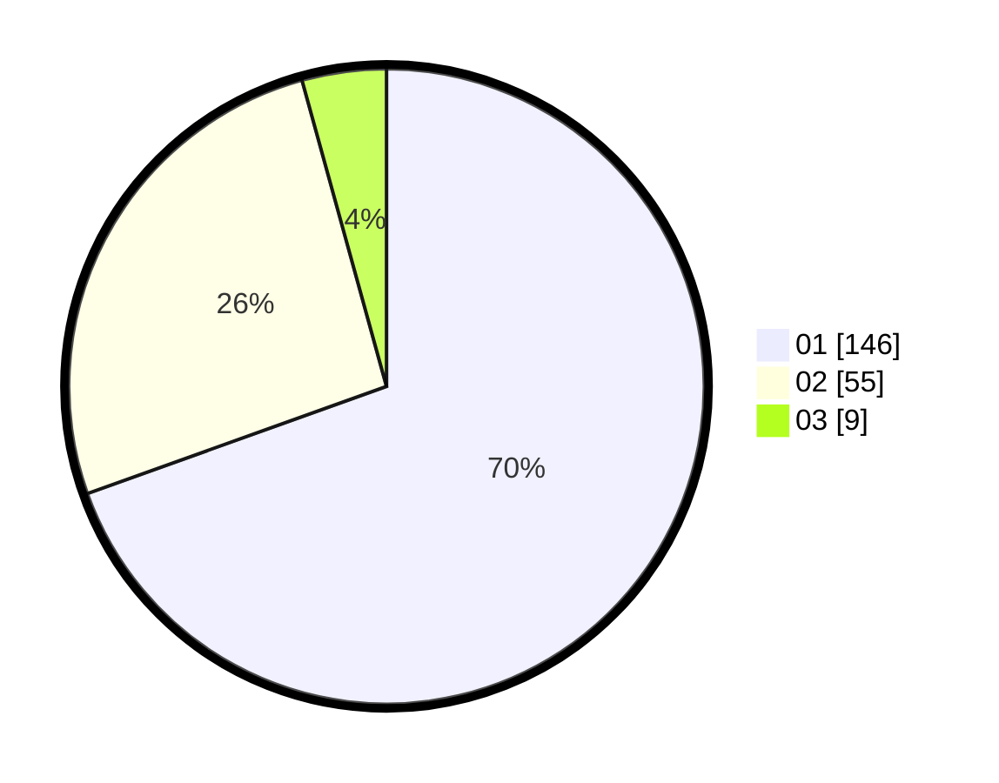

# Hasil

Hasil perolehan suara paslon dapat dilihat pada file paslon-01.txt, paslon-02.txt, dan paslon-03.txt.

Jika tidak ada, artinya data tersebut belum ada pada SIREKAP.

## Perolehan Suara

 * Paslon 01: **146**.
 * Paslon 02: **55**.
 * Paslon 03: **9**.

## Foto C Plano

https://sirekap-obj-formc.kpu.go.id/6447/pemilu/ppwp/31/71/07/10/04/3171071004060-20240214-185831--fa19a08f-8717-419a-a5d9-c86c810a9f60.jpg

https://sirekap-obj-formc.kpu.go.id/6447/pemilu/ppwp/31/71/07/10/04/3171071004060-20240214-185922--b1693853-e8f2-44cd-86b8-fa78c0859b8b.jpg

https://sirekap-obj-formc.kpu.go.id/6447/pemilu/ppwp/31/71/07/10/04/3171071004060-20240214-190047--727145a5-4307-4af5-9745-5e279fa95381.jpg
