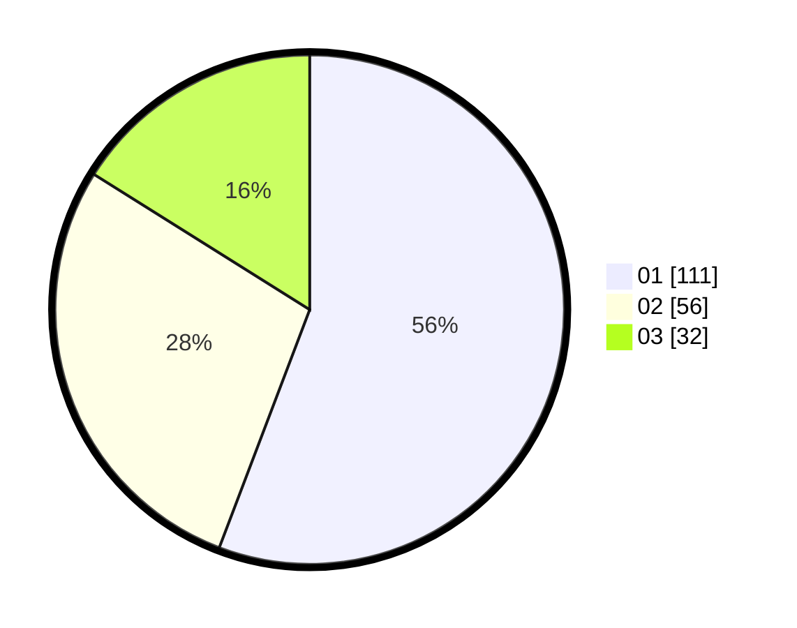

# Hasil

Hasil perolehan suara paslon dapat dilihat pada file paslon-01.txt, paslon-02.txt, dan paslon-03.txt.

Jika tidak ada, artinya data tersebut belum ada pada SIREKAP.

## Perolehan Suara

 * Paslon 01: **111**.
 * Paslon 02: **56**.
 * Paslon 03: **32**.

## Foto C Plano

https://sirekap-obj-formc.kpu.go.id/c758/pemilu/ppwp/31/71/07/10/04/3171071004069-20240214-215221--f98ae3c5-f149-4da9-91ca-097d1e05bc80.jpg

https://sirekap-obj-formc.kpu.go.id/c758/pemilu/ppwp/31/71/07/10/04/3171071004069-20240214-215326--839f8df1-2acf-4950-888d-e8141bc868da.jpg

https://sirekap-obj-formc.kpu.go.id/c758/pemilu/ppwp/31/71/07/10/04/3171071004069-20240214-215413--16f4ca45-3691-4ad6-a6c0-e97626559c25.jpg

## DATA PEMILIH TETAP

Jumlah pemilih dalam DPT: **259**.
 * L: **129**.
 * P: **130**.

## DATA PENGGUNA HAK PILIH

Jumlah pengguna hak pilih dalam DPT: **198**.
 * L: **90**.
 * P: **108**.

Jumlah pengguna hak pilih dalam DPTb: **3**.
 * L: **3**.
 * P: **0**.

Jumlah pengguna hak pilih dalam DPK: **0**.
 * L: **0**.
 * P: **0**.

Jumlah pengguna hak pilih: **201**.
 * L: **93**.
 * P: **108**.

## JUMLAH SUARA SAH DAN TIDAK SAH

JUMLAH SELURUH SUARA SAH: **199**.

JUMLAH SUARA TIDAK SAH: **2**.

JUMLAH SELURUH SUARA SAH DAN SUARA TIDAK SAH: **201**.
