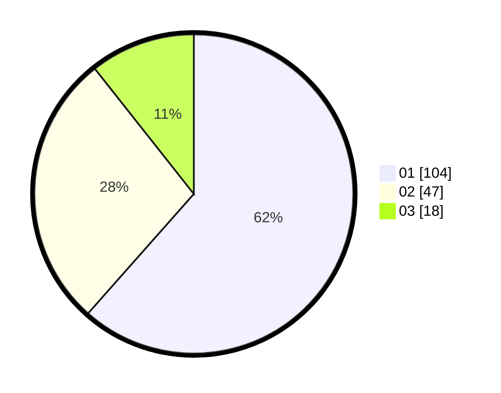

# Hasil

Hasil perolehan suara paslon dapat dilihat pada file paslon-01.txt, paslon-02.txt, dan paslon-03.txt.

Jika tidak ada, artinya data tersebut belum ada pada SIREKAP.

## Perolehan Suara

 * Paslon 01: **104**.
 * Paslon 02: **47**.
 * Paslon 03: **18**.

## Foto C Plano

https://sirekap-obj-formc.kpu.go.id/232b/pemilu/ppwp/31/71/07/10/04/3171071004071-20240216-032859--6edfcaad-6f49-40db-9ae4-ecb7e17dcb98.jpg

https://sirekap-obj-formc.kpu.go.id/232b/pemilu/ppwp/31/71/07/10/04/3171071004071-20240216-151126--7bbb2504-3de3-49a2-99c8-5396ab604da4.jpg

https://sirekap-obj-formc.kpu.go.id/232b/pemilu/ppwp/31/71/07/10/04/3171071004071-20240216-032901--cdcf8930-5ffb-48d5-97f7-31b2bb2c9e56.jpg

## DATA PEMILIH TETAP

Jumlah pemilih dalam DPT: **220**.
 * L: **102**.
 * P: **118**.

## DATA PENGGUNA HAK PILIH

Jumlah pengguna hak pilih dalam DPT: **170**.
 * L: **79**.
 * P: **91**.

Jumlah pengguna hak pilih dalam DPTb: **2**.
 * L: **0**.
 * P: **2**.

Jumlah pengguna hak pilih dalam DPK: **0**.
 * L: **0**.
 * P: **0**.

Jumlah pengguna hak pilih: **172**.
 * L: **79**.
 * P: **93**.

## JUMLAH SUARA SAH DAN TIDAK SAH

JUMLAH SELURUH SUARA SAH: **169**.

JUMLAH SUARA TIDAK SAH: **3**.

JUMLAH SELURUH SUARA SAH DAN SUARA TIDAK SAH: **172**.
